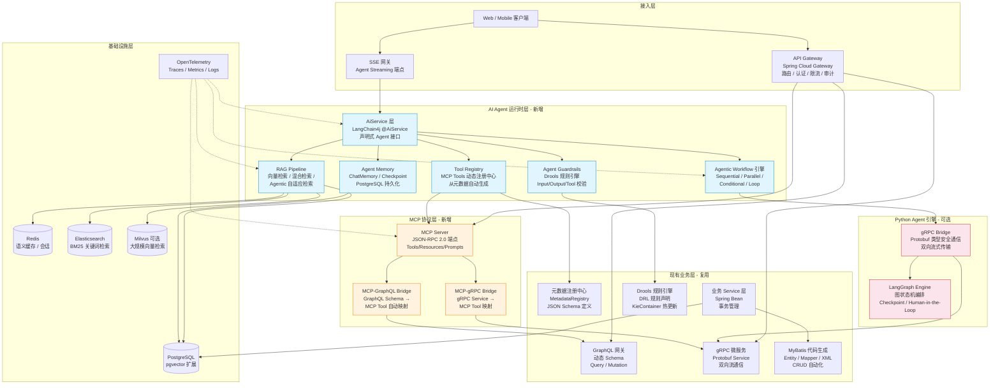

# T6: AI Agent 集成架构设计

**日期**: 2026-05-31  
**依赖**: T3 (Agent 框架调研), T4 (协议与基础设施调研), T5 (差距分析)  
**目标**: 基于差距分析结果，设计具体可落地的 AI Agent 集成架构方案

---

## 目录

1. [目标架构全景图](#1-目标架构全景图)
2. [Agent 运行时层设计](#2-agent-运行时层设计)
3. [MCP Server 设计 — 元数据驱动的 Tool 自动生成](#3-mcp-server-设计--元数据驱动的-tool-自动生成)
4. [Agentic RAG Pipeline](#4-agentic-rag-pipeline)
5. [Agent 护栏系统 — Drools 规则引擎复用](#5-agent-护栏系统--drools-规则引擎复用)
6. [可观测性设计 — OpenTelemetry 全链路追踪](#6-可观测性设计--opentelemetry-全链路追踪)
7. [技术栈推荐 — 完整依赖坐标与版本](#7-技术栈推荐--完整依赖坐标与版本)
8. [与现有系统对接](#8-与现有系统对接)

---

## 1. 目标架构全景图

### 1.1 分层架构总览



### 1.2 核心设计原则

| 原则 | 描述 | 架构体现 |
|------|------|---------|
| **最小侵入** | 不修改现有业务代码，新组件作为增强层叠加 | 所有 AI 组件在独立 Maven 模块中，通过依赖注入与现有层对接 |
| **渐进式采用** | 每个阶段均可独立交付价值，不依赖完整体系 | Phase 1: @AiService + @Tool → Phase 2: MCP → Phase 3: LangGraph |
| **资产复用优先** | 最大化利用现有 7 大架构模式 | 元数据→Tool 生成，GraphQL→MCP 映射，Drools→Guardrails |
| **协议标准化** | 采用 MCP / A2A 开放标准，避免供应商锁定 | MCP JSON-RPC 2.0 端点，A2A Agent Card 发现机制 |
| **安全内建** | Agent 安全边界在设计阶段定义，不事后补丁 | 租户上下文注入、Tool 级 ACL、调用链鉴权 |
| **可观测性标配** | 所有 Agent 调用链路可追踪、可度量 | OpenTelemetry Span 覆盖 LLM 调用、Tool 执行、Guardrail 触发 |

### 1.3 模块边界规划

```
项目根目录
├── app-agent/                        ← 新增：AI Agent 聚合模块
│   ├── app-agent-core/               ← Agent 运行时核心（@AiService, Workflow, Memory）
│   ├── app-agent-mcp/                ← MCP Server 实现（JSON-RPC 端点, Tool 管理）
│   ├── app-agent-rag/                ← RAG Pipeline（Embedding, VectorStore, Retriever）
│   ├── app-agent-guardrails/         ← Agent 护栏（Drools 集成, 输入输出校验）
│   ├── app-agent-observability/      ← 可观测性（Micrometer 扩展, Trace 存储）
│   ├── app-agent-plugins/            ← Maven 插件（编译期 Tool 代码生成）
│   └── app-agent-bridge/             ← Python Bridge（gRPC Client, Proto 编译）
├── app-common-api/                   ← 现有：不改动
├── app-xxx-api/ (各业务模块)          ← 现有：不改动，通过 Maven 插件自动生成 Agent 代码
└── ...
```

---

## 2. Agent 运行时层设计

### 2.1 LangChain4j @AiService 集成方案

#### 2.1.1 架构概览

```
┌───────────────────────────────────────────────────────────────────┐
│                    Agent 运行时层 (app-agent-core)                   │
│                                                                     │
│  ┌─────────────────────────────────────────────────────────────┐  │
│  │                    @AiService 接口层                          │  │
│  │                                                               │  │
│  │  @AiService                                                   │  │
│  │  interface MetadataAgent {                                   │  │
│  │      @SystemMessage("你是元数据管理助手，可以查询和操作        │  │
│  │                      业务实体。当前租户：{{tenantId}}")        │  │
│  │      String chat(@MemoryId String sessionId,                  │  │
│  │                   @UserMessage String userMessage);           │  │
│  │  }                                                            │  │
│  └───────────────────────────┬─────────────────────────────────┘  │
│                              │                                      │
│  ┌───────────────────────────▼─────────────────────────────────┐  │
│  │               Agentic Workflow 编排层                         │  │
│  │                                                               │  │
│  │  SequentialAgent   → 步骤 A → 步骤 B → 步骤 C               │  │
│  │  ParallelAgent     → [A ∥ B ∥ C] → 聚合                     │  │
│  │  ConditionalAgent  → 条件判断 → 分支 A / 分支 B              │  │
│  │  LoopAgent         → 迭代执行 → 质量门控 → 退出              │  │
│  └───────────────────────────┬─────────────────────────────────┘  │
│                              │                                      │
│  ┌───────────────────────────▼─────────────────────────────────┐  │
│  │                      Tool 执行层                              │  │
│  │                                                               │  │
│  │  @Tool("查询 {{entityLabel}} 数据")                          │  │
│  │  public List<JsonObject> queryEntity(                        │  │
│  │      @ToolParam("实体名称") String entityName,               │  │
│  │      @ToolParam("过滤条件") Map<String, Object> filters      │  │
│  │  ) { ... }                                                   │  │
│  └─────────────────────────────────────────────────────────────┘  │
└───────────────────────────────────────────────────────────────────┘
```

#### 2.1.2 AiService 接口设计模式

基于现有 API/Impl 分离模式，Agent 接口遵循相同的契约分离原则：

```java
// ===== API 层: 声明式契约 (app-agent-core-api) =====
package com.example.app.agent.api;

import dev.langchain4j.service.*;

@AiService
public interface MetadataQueryAgent {

    @SystemMessage("""
        你是一个企业元数据查询助手。
        你可以通过以下工具查询业务数据：
        - queryEntity: 查询指定实体的数据
        - getEntitySchema: 获取实体字段定义
        - executeCustomQuery: 执行自定义 GraphQL 查询
        
        安全约束：
        - 只能查询当前租户({{tenantId}})权限范围内的数据
        - 不能执行数据修改操作（insert/update/delete）
        - 敏感字段（如 password, secret）不能出现在返回结果中
        """)
    String chat(
        @MemoryId String sessionId,
        @UserName String username,
        @UserMessage String userMessage
    );
}

// ===== 配置层: Tool 注册 (app-agent-core-impl) =====
package com.example.app.agent.impl;

@Configuration
public class AgentToolConfiguration {

    @Bean
    public MetadataQueryAgent metadataQueryAgent(
        ChatLanguageModel model,
        MetadataToolProvider toolProvider,
        ChatMemoryStore memoryStore
    ) {
        return AiServices.builder(MetadataQueryAgent.class)
            .chatLanguageModel(model)
            .tools(toolProvider.getTools())
            .chatMemoryProvider(memoryId ->
                MessageWindowChatMemory.builder()
                    .id(memoryId)
                    .maxMessages(20)
                    .chatMemoryStore(memoryStore)
                    .build()
            )
            .build();
    }
}
```

#### 2.1.3 Agentic Workflow 编排示例

利用 LangChain4j v1.15+ 的 Agentic Workflow 能力覆盖企业常见编排场景：

```java
// ===== 场景 1: 顺序工作流 — 数据查询 → 分析 → 报告 =====
@Component
public class DataAnalysisWorkflow {

    private final Agent<JsonObject> queryAgent;
    private final Agent<String> analysisAgent;
    private final Agent<String> reportAgent;

    public DataAnalysisWorkflow(
        Agent<JsonObject> queryAgent,
        Agent<String> analysisAgent,
        Agent<String> reportAgent
    ) {
        this.queryAgent = queryAgent;
        this.analysisAgent = analysisAgent;
        this.reportAgent = reportAgent;
    }

    public String execute(String userRequest) {
        return AgenticServices.sequenceBuilder()
            .agent(queryAgent)       // 步骤1: 查询数据
            .agent(analysisAgent)    // 步骤2: 分析数据
            .agent(reportAgent)      // 步骤3: 生成报告
            .build()
            .execute(userRequest);
    }
}

// ===== 场景 2: 并行工作流 — 多源数据同时检索 =====
@Component
public class MultiSourceSearchWorkflow {

    private final Agent<String> vectorSearchAgent;
    private final Agent<String> keywordSearchAgent;
    private final Agent<String> graphSearchAgent;

    public List<String> parallelSearch(SearchRequest request) {
        return AgenticServices.parallelBuilder()
            .agent(vectorSearchAgent)   // 语义向量搜索
            .agent(keywordSearchAgent)  // BM25 关键词搜索
            .agent(graphSearchAgent)    // 知识图谱遍历
            .maxConcurrency(3)
            .build()
            .execute(request);
    }
}

// ===== 场景 3: 条件工作流 — 意图路由 =====
@Component
public class IntentRouterWorkflow {

    public String route(String userInput) {
        return AgenticServices.conditionalBuilder()
            .condition("input contains 'data query' or '查询' or 'search'",
                scope -> scope.agent(dataQueryAgent))
            .condition("input contains 'report' or 'analysis' or '分析'",
                scope -> scope.agent(analysisAgent))
            .condition("input contains 'approval' or '审批'",
                scope -> scope.agent(approvalAgent))
            .orElse(generalAgent)
            .build()
            .execute(userInput);
    }
}

// ===== 场景 4: 循环工作流 — 质量迭代优化 =====
@Component
public class QualityIterationWorkflow {

    public Report generateWithQualityGate(ReportRequest request) {
        return AgenticServices.loopBuilder()
            .agent(reportGenerationAgent)   // 生成报告
            .condition("quality score should be > 8",
                scope -> {
                    ReportQuality score = qualityEvaluator.evaluate(
                        scope.currentOutput()
                    );
                    if (score.getValue() > 8) {
                        scope.approve(scope.currentOutput());
                    }
                }
            )
            .maxIterations(3)
            .build()
            .execute(request);
    }
}
```

### 2.2 LangGraph gRPC Bridge 设计

#### 2.2.1 设计原理

LangGraph Bridge 仅在 LangChain4j Agentic Workflow 无法满足需求时启用（Phase 3+），典型触发场景：
- 需要 Human-in-the-Loop 中断控制（审批工作流）
- 需要 Durable Execution 和 Checkpoint 恢复（长事务）
- 复杂的多 Agent 子图编排

```
┌───────────────────────────────────────────────────────────────┐
│                    Spring Boot 主进程 (Java 17+)                │
│                                                                 │
│  ┌──────────────────────────────────┐                          │
│  │  AgenticWorkflowCoordinator      │                          │
│  │  ┌──────────────────────────────┐│                          │
│  │  │ 决策: 工作流复杂度评估        ││                          │
│  │  │                               ││                          │
│  │  │  if (complexity <= MEDIUM) {  ││                          │
│  │  │    → LangChain4j Workflow     ││  本地执行                │
│  │  │  } else {                     ││                          │
│  │  │    → LangGraph Bridge         ││  委托 Python Engine      │
│  │  │  }                            ││                          │
│  │  └──────────────────────────────┘│                          │
│  └───────────────┬──────────────────┘                          │
│                  │                                              │
│  ┌───────────────▼──────────────────┐                          │
│  │   LangGraphGrpcClient            │                          │
│  │   ──────────────────────────────  │                          │
│  │   - invoke(WorkflowRequest)       │  双向流:                 │
│  │   - streamEvents(WorkflowReq)     │  推送进度/中断/故障      │
│  │   - resume(ResumeRequest)         │  接收人工决策            │
│  │   - cancel(CancelRequest)         │                          │
│  │                                  │                          │
│  │   复用现有 gRPC 基础设施:         │                          │
│  │   - Protobuf 编译流水线           │                          │
│  │   - gRPC Channel Pool             │                          │
│  │   - mTLS 证书管理                 │                          │
│  └───────────────┬──────────────────┘                          │
└──────────────────┼──────────────────────────────────────────────┘
                   │  gRPC over HTTP/2 + Protobuf
                   │  Bidirectional Streaming
┌──────────────────┼──────────────────────────────────────────────┐
│  ┌───────────────▼──────────────────┐                          │
│  │   LangGraphGrpcServer            │                          │
│  │   ──────────────────────────────  │                          │
│  │   Python 3.12 + grpcio            │                          │
│  │                                  │                          │
│  │   LangGraph 图执行引擎:           │                          │
│  │   - StateGraph 构建与执行          │                          │
│  │   - Checkpoint（PostgresSaver）    │                          │
│  │   - interrupt() 挂起等待          │                          │
│  │   - Command(resume=...) 恢复      │                          │
│  │   - 子图嵌套（SubGraph）           │                          │
│  └──────────────────────────────────┘                          │
│                                                                 │
│              Python Agent Engine (Sidecar Container)             │
└─────────────────────────────────────────────────────────────────┘
```

#### 2.2.2 Protobuf 契约定义

```protobuf
// app-agent-bridge/src/main/proto/agent_orchestrator.proto
syntax = "proto3";

package com.example.app.agent.bridge;

option java_multiple_files = true;
option java_package = "com.example.app.agent.bridge.proto";

// 工作流编排服务
service AgentOrchestrator {

  // 执行工作流（同步，适用于短任务）
  rpc Invoke(WorkflowRequest) returns (WorkflowResponse);

  // 流式执行工作流（适用于长任务、需要实时反馈）
  rpc StreamExecute(WorkflowRequest) returns (stream AgentEvent);

  // 恢复挂起的工作流（Human-in-the-Loop）
  rpc Resume(ResumeRequest) returns (ResumeResponse);

  // 取消工作流
  rpc Cancel(CancelRequest) returns (CancelResponse);

  // 获取工作流状态
  rpc GetStatus(StatusRequest) returns (StatusResponse);
}

// ===== 消息定义 =====

message WorkflowRequest {
  string graph_id = 1;               // 工作流图 ID
  string thread_id = 2;              // 会话/线程 ID（Checkpoint 隔离）
  string tenant_id = 3;              // 租户 ID（多租户隔离）
  map<string, string> initial_state = 4;  // 初始状态
  string user_id = 5;                // 操作用户
}

message WorkflowResponse {
  string thread_id = 1;
  string status = 2;                 // "completed", "interrupted", "failed"
  map<string, string> final_state = 3;
  repeated Artifact artifacts = 4;
}

message AgentEvent {
  string node_id = 1;                // 当前节点
  string event_type = 2;             // "node_start", "node_end", "interrupt",
                                     // "stream_chunk", "error", "progress"
  string data = 3;                   // JSON 编码的事件数据
  map<string, string> metadata = 4;  // 元数据（token 消耗、延迟等）
}

message ResumeRequest {
  string thread_id = 1;
  string action = 2;                 // "approve", "reject", "edit", "response"
  map<string, string> action_data = 3;
}

message ResumeResponse {
  string thread_id = 1;
  string status = 2;
  map<string, string> result = 3;
}

message CancelRequest {
  string thread_id = 1;
  string reason = 2;
}

message CancelResponse {
  bool success = 1;
  string message = 2;
}

message StatusRequest {
  string thread_id = 1;
}

message StatusResponse {
  string thread_id = 1;
  string status = 2;                 // "running", "interrupted", "completed",
                                     // "failed", "cancelled"
  string current_node = 3;
  map<string, string> state_snapshot = 4;
  int64 created_at_ms = 5;
  int64 updated_at_ms = 6;
}

message Artifact {
  string artifact_id = 1;
  string name = 2;
  string mime_type = 3;
  bytes data = 4;
}
```

#### 2.2.3 Python Sidecar 部署架构

```yaml
# Kubernetes Sidecar 部署示例
apiVersion: apps/v1
kind: Deployment
metadata:
  name: spring-boot-app
spec:
  template:
    spec:
      containers:
        # 主容器: Spring Boot
        - name: app
          image: myapp/spring-boot:latest
          ports:
            - containerPort: 8080
          env:
            - name: AGENT_ENGINE_GRPC_HOST
              value: "localhost"
            - name: AGENT_ENGINE_GRPC_PORT
              value: "50051"

        # Sidecar: Python Agent Engine
        - name: agent-engine
          image: myapp/agent-engine-python:latest
          ports:
            - containerPort: 50051
          resources:
            limits:
              memory: "1024Mi"
              cpu: "1000m"
            requests:
              memory: "256Mi"
              cpu: "250m"
          readinessProbe:
            grpc:
              port: 50051
            initialDelaySeconds: 5
```

#### 2.2.4 故障隔离与降级策略

```
LangGraph Engine 调用失败时:
  1. 网络超时 (5s) → gRPC DeadlineExceeded
     → 自动重试 1 次 → 仍失败则降级到 LangChain4j 本地执行

  2. Python Engine 不可用 (UNAVAILABLE)
     → 触发熔断（Circuit Breaker: 5 次失败 → 30s 熔断）
     → 期间所有请求降级到 LangChain4j 本地执行
     → 半开恢复：每 30s 尝试一次探测

  3. LangGraph checkpoint 损坏
     → 从 PostgresSaver 的最新有效 checkpoint 恢复
     → 通知运维：checkpoint 完整性告警

  4. 版本不兼容（Protobuf 字段不匹配）
     → 构建期 Protobuf 兼容性检查（buf breaking）
     → 运行时版本协商：gRPC header 携带 agent-engine-version
```

---

## 3. MCP Server 设计 — 元数据驱动的 Tool 自动生成

### 3.1 核心创新：Schema2MCP 转换引擎

本方案的核心创新是利用现有 JSON Schema 元数据定义，自动生成 Agent 可调用的 MCP Tool 注册表。这是 T5 报告中识别出的"五星级契合度"集成点。

```
┌──────────────────────────────────────────────────────────────────┐
│                  元数据驱动 → MCP Tool 自动生成                   │
│                                                                   │
│  ┌─────────────────────────────────────────────────────────┐    │
│  │              JSON Schema 元数据 (现有)                     │    │
│  │                                                           │    │
│  │  {                                                        │    │
│  │    "entityName": "Order",                                 │    │
│  │    "label": "订单",                                       │    │
│  │    "description": "客户订单实体，记录交易信息",             │    │
│  │    "properties": {                                        │    │
│  │      "orderId": {                                         │    │
│  │        "type": "string",                                  │    │
│  │        "label": "订单号",                                  │    │
│  │        "description": "唯一订单标识"                        │    │
│  │      },                                                   │    │
│  │      "amount": {                                          │    │
│  │        "type": "number",                                  │    │
│  │        "label": "金额",                                    │    │
│  │        "description": "订单总金额（元）"                    │    │
│  │      },                                                   │    │
│  │      "status": {                                          │    │
│  │        "type": "string",                                  │    │
│  │        "enum": ["pending", "paid", "shipped", "done"],    │    │
│  │        "label": "状态"                                     │    │
│  │      }                                                    │    │
│  │    }                                                      │    │
│  │  }                                                        │    │
│  └──────────────────┬──────────────────────────────────────┘    │
│                     │  Schema2MCP 转换引擎                        │
│                     ▼                                             │
│  ┌─────────────────────────────────────────────────────────┐    │
│  │              MCP Tool 注册表 (自动生成)                    │    │
│  │                                                           │    │
│  │  {                                                        │    │
│  │    "name": "query_order",                                 │    │
│  │    "description": "查询订单数据。客户订单实体，             │    │
│  │                    记录交易信息",                           │    │
│  │    "inputSchema": {                                       │    │
│  │      "type": "object",                                    │    │
│  │      "properties": {                                      │    │
│  │        "orderId": {                                       │    │
│  │          "type": "string",                                │    │
│  │          "description": "唯一订单标识"                      │    │
│  │        },                                                 │    │
│  │        "amount_range": {                                  │    │
│  │          "type": "object",                                │    │
│  │          "description": "金额范围过滤"                      │    │
│  │        },                                                 │    │
│  │        "status": {                                        │    │
│  │          "type": "string",                                │    │
│  │          "enum": ["pending","paid","shipped","done"],      │    │
│  │          "description": "订单状态"                          │    │
│  │        }                                                  │    │
│  │      }                                                    │    │
│  │    }                                                      │    │
│  │  }                                                        │    │
│  └─────────────────────────────────────────────────────────┘    │
└──────────────────────────────────────────────────────────────────┘
```

### 3.2 Schema2MCP 转换器实现

```java
// ===== 核心转换器 =====
package com.example.app.agent.mcp.converter;

import com.fasterxml.jackson.databind.JsonNode;
import com.fasterxml.jackson.databind.node.ObjectNode;
import com.fasterxml.jackson.databind.node.ArrayNode;

/**
 * 将 JSON Schema 元数据定义自动转换为 MCP Tool 规范。
 *
 * 映射规则:
 *   entityName + "list"  → Tool.name (query_entityName)
 *   entity.label         → Tool.description 前缀
 *   entity.description   → Tool.description 主体
 *   property.description → Tool.inputSchema.properties.description
 *   property.type        → Tool.inputSchema.properties.type
 *   property.enum        → Tool.inputSchema.properties.enum
 */
@Component
public class Schema2MCPConverter {

    private static final Set<String> MCP_TOOL_ACTIONS =
        Set.of("query", "get", "create", "update", "delete");

    /**
     * 将实体元数据 JSON Schema 转换为 MCP Tool 列表。
     *
     * @param schemaNode   实体 JSON Schema 节点
     * @param actions      需要生成的操作类型（query/get/create/update/delete）
     * @return MCP Tool 规范列表
     */
    public List<McpToolSpec> convert(JsonNode schemaNode, Set<String> actions) {
        String entityName = schemaNode.get("entityName").asText();
        String label = schemaNode.get("label").asText();
        String description = schemaNode.path("description").asText("");

        List<McpToolSpec> tools = new ArrayList<>();

        for (String action : actions) {
            McpToolSpec spec = switch (action) {
                case "query" -> buildQueryTool(entityName, label, description, schemaNode);
                case "get"   -> buildGetTool(entityName, label, description, schemaNode);
                case "create"-> buildCreateTool(entityName, label, description, schemaNode);
                case "update"-> buildUpdateTool(entityName, label, description, schemaNode);
                case "delete"-> buildDeleteTool(entityName, label, description, schemaNode);
                default      -> throw new IllegalArgumentException("Unknown action: " + action);
            };
            tools.add(spec);
        }

        return tools;
    }

    private McpToolSpec buildQueryTool(
        String entityName, String label, String description, JsonNode schema
    ) {
        ObjectNode inputSchema = JsonNodeFactory.instance.objectNode();
        inputSchema.put("type", "object");

        ObjectNode properties = inputSchema.putObject("properties");

        // 分页参数
        properties.putObject("page")
            .put("type", "integer")
            .put("description", "页码，从1开始，默认1");
        properties.putObject("pageSize")
            .put("type", "integer")
            .put("description", "每页条数，默认20，最大100");

        // 从 JSON Schema properties 生成过滤参数
        JsonNode schemaProps = schema.path("properties");
        if (schemaProps.isObject()) {
            ObjectNode filterProps = properties.putObject("filters");
            filterProps.put("type", "object");
            filterProps.put("description", "过滤条件，支持以下字段的组合查询");

            ObjectNode filterProperties = filterProps.putObject("properties");
            schemaProps.fields().forEachRemaining(entry -> {
                String propName = entry.getKey();
                JsonNode propDef = entry.getValue();
                ObjectNode propSchema = filterProperties.putObject(propName);

                // 类型映射
                String jsonType = mapJsonType(propDef.path("type").asText());
                propSchema.put("type", jsonType);

                // 描述传递
                String propDesc = propDef.path("description").asText();
                String propLabel = propDef.path("label").asText();
                propSchema.put("description",
                    StringUtils.hasText(propDesc) ? propDesc
                        : propLabel + " 的过滤条件");

                // 枚举传递
                if (propDef.has("enum")) {
                    ArrayNode enumValues = propSchema.putArray("enum");
                    propDef.get("enum").forEach(enumValues::add);
                }
            });
        }

        return McpToolSpec.builder()
            .name("query_" + entityName.toLowerCase())
            .description(buildDescription(action="query", label, description))
            .inputSchema(inputSchema)
            .build();
    }

    private McpToolSpec buildCreateTool(
        String entityName, String label, String description, JsonNode schema
    ) {
        // CREATE Tool: inputSchema 包含所有必需的属性
        // 省略具体实现，逻辑类似 query，但将所有必填字段作为 Tool 参数
        // ...
        return McpToolSpec.builder()
            .name("create_" + entityName.toLowerCase())
            .description(buildDescription("create", label, description))
            .inputSchema(buildCreateUpdateSchema(schema, true))
            .build();
    }

    private McpToolSpec buildUpdateTool(
        String entityName, String label, String description, JsonNode schema
    ) {
        return McpToolSpec.builder()
            .name("update_" + entityName.toLowerCase())
            .description(buildDescription("update", label, description))
            .inputSchema(buildCreateUpdateSchema(schema, false))
            .build();
    }

    private McpToolSpec buildGetTool(
        String entityName, String label, String description, JsonNode schema
    ) {
        ObjectNode inputSchema = JsonNodeFactory.instance.objectNode();
        inputSchema.put("type", "object");
        ObjectNode props = inputSchema.putObject("properties");
        props.putObject("id")
            .put("type", "string")
            .put("description", entityName + " 的唯一标识");

        return McpToolSpec.builder()
            .name("get_" + entityName.toLowerCase())
            .description(buildDescription("get", label, description))
            .inputSchema(inputSchema)
            .build();
    }

    private McpToolSpec buildDeleteTool(
        String entityName, String label, String description, JsonNode schema
    ) {
        ObjectNode inputSchema = JsonNodeFactory.instance.objectNode();
        inputSchema.put("type", "object");
        ObjectNode props = inputSchema.putObject("properties");
        props.putObject("id")
            .put("type", "string")
            .put("description", entityName + " 的唯一标识");
        props.putObject("confirm")
            .put("type", "boolean")
            .put("description", "确认删除操作，必须为 true");

        return McpToolSpec.builder()
            .name("delete_" + entityName.toLowerCase())
            .description(buildDescription("delete", label, description))
            .inputSchema(inputSchema)
            .build();
    }

    private String buildDescription(String action, String label, String description) {
        String actionCN = switch (action) {
            case "query"  -> "查询";
            case "get"    -> "获取";
            case "create" -> "创建";
            case "update" -> "更新";
            case "delete" -> "删除";
            default       -> action;
        };
        return String.format("%s%s。%s", actionCN, label, description);
    }

    private String mapJsonType(String schemaType) {
        return switch (schemaType) {
            case "integer", "long"   -> "integer";
            case "number", "double", "float", "decimal" -> "number";
            case "boolean"           -> "boolean";
            case "array", "list"     -> "array";
            default                  -> "string";
        };
    }

    // ===== MCP Tool 规范数据类 =====
    @Data
    @Builder
    public static class McpToolSpec {
        private String name;
        private String description;
        private JsonNode inputSchema;
        private List<String> tags;
        private String securityLevel;  // "read", "write", "admin"
        private boolean enabled;
    }
}
```

### 3.3 动态 Tool 注册器 — MetadataDrivenToolProvider

```java
/**
 * 监听元数据注册中心变更，动态同步 MCP Tool 注册表。
 *
 * 工作流程:
 *   1. 启动时从 MetadataRegistry 加载全部实体
 *   2. 通过 Schema2MCPConverter 生成 Tool 规范
 *   3. 注册到 MCP Server 的 ToolProvider
 *   4. 监听 Registry 变更事件，实时增删 Tool
 *   5. 发送 notifications/tools/list_changed 通知客户端
 */
@Component
public class MetadataDrivenToolProvider
    implements ToolProvider, ApplicationListener<MetadataRegistryChangeEvent> {

    private static final Logger log = LoggerFactory.getLogger(
        MetadataDrivenToolProvider.class
    );

    private final MetadataRegistry registry;
    private final Schema2MCPConverter converter;
    private final AgentSecurityConfig securityConfig;

    // 动态 Tool 注册表
    private final ConcurrentMap<String, McpToolSpec> registeredTools =
        new ConcurrentHashMap<>();

    // MCP 客户端事件通知
    private final List<McpClientNotifier> notifiers = new CopyOnWriteArrayList<>();

    public MetadataDrivenToolProvider(
        MetadataRegistry registry,
        Schema2MCPConverter converter,
        AgentSecurityConfig securityConfig
    ) {
        this.registry = registry;
        this.converter = converter;
        this.securityConfig = securityConfig;
    }

    @PostConstruct
    public void initialize() {
        // 启动时加载所有实体
        Collection<EntityMeta> entities = registry.getAllEntities();
        for (EntityMeta entity : entities) {
            registerEntityTools(entity);
        }
        log.info("Initialized {} MCP tools from {} entities",
            registeredTools.size(), entities.size());
    }

    /**
     * 为单个实体注册 MCP Tool。
     * 根据实体的安全级别决定注册哪些操作类型。
     */
    private void registerEntityTools(EntityMeta entity) {
        JsonNode schemaNode = entity.getJsonSchema();

        // 根据实体的读写属性决定可注册的 Tool 操作
        Set<String> actions = new LinkedHashSet<>();
        if (entity.isReadable()) {
            actions.add("query");
            actions.add("get");
        }
        if (entity.isWritable()) {
            actions.add("create");
            actions.add("update");
        }
        if (entity.isDeletable()) {
            actions.add("delete");
        }

        List<McpToolSpec> tools = converter.convert(schemaNode, actions);

        for (McpToolSpec tool : tools) {
            // 附加安全级别和标签
            tool.setSecurityLevel(entity.isWritable() ? "write" : "read");
            tool.setTags(List.of(
                "entity:" + entity.getName(),
                "module:" + entity.getModuleName()
            ));

            registeredTools.put(tool.getName(), tool);
            log.debug("Registered MCP Tool: {}", tool.getName());
        }
    }

    /**
     * 监听元数据注册中心变更，实现 Tool 热更新。
     */
    @Override
    public void onApplicationEvent(MetadataRegistryChangeEvent event) {
        switch (event.getType()) {
            case ENTITY_ADDED -> {
                EntityMeta entity = event.getEntity();
                registerEntityTools(entity);
                notifyToolsChanged();
                log.info("MCP Tools updated: added tools for entity '{}'",
                    entity.getName());
            }
            case ENTITY_REMOVED -> {
                String entityName = event.getEntity().getName();
                registeredTools.entrySet().removeIf(entry ->
                    entry.getKey().contains(entityName.toLowerCase())
                );
                notifyToolsChanged();
                log.info("MCP Tools updated: removed tools for entity '{}'",
                    entityName);
            }
            case ENTITY_UPDATED -> {
                String entityName = event.getEntity().getName();
                // 移除旧的，重新注册
                registeredTools.entrySet().removeIf(entry ->
                    entry.getKey().contains(entityName.toLowerCase())
                );
                registerEntityTools(event.getEntity());
                notifyToolsChanged();
                log.info("MCP Tools updated: refreshed tools for entity '{}'",
                    entityName);
            }
        }
    }

    /**
     * 通知所有连接的 MCP 客户端：Tool 列表已变更。
     * 对应 MCP 协议的 notifications/tools/list_changed。
     */
    private void notifyToolsChanged() {
        for (McpClientNotifier notifier : notifiers) {
            try {
                notifier.notifyToolsListChanged();
            } catch (Exception e) {
                log.warn("Failed to notify MCP client: {}", notifier, e);
            }
        }
    }

    // ===== ToolProvider 接口实现 =====

    @Override
    public List<McpToolSpec> listTools(String tenantId) {
        // 租户感知过滤: 仅返回当前租户有权限的 Tool
        return registeredTools.values().stream()
            .filter(tool -> securityConfig.isToolAccessible(tenantId, tool.getName()))
            .collect(Collectors.toList());
    }

    @Override
    public Optional<McpToolSpec> getTool(String toolName) {
        return Optional.ofNullable(registeredTools.get(toolName));
    }

    @Override
    public ToolResult executeTool(String toolName, Map<String, Object> params,
                                   String tenantId, String userId) {
        // 1. 安全检查
        McpToolSpec tool = registeredTools.get(toolName);
        if (tool == null) {
            return ToolResult.error("Tool not found: " + toolName);
        }
        if (!securityConfig.isToolAccessible(tenantId, toolName)) {
            return ToolResult.error("Access denied to tool: " + toolName);
        }

        // 2. 参数校验（使用 JSON Schema validation）
        JsonNode paramsNode = JsonUtils.toJsonNode(params);
        ValidationResult validation = JsonSchemaValidator.validate(
            tool.getInputSchema(), paramsNode
        );
        if (!validation.isValid()) {
            return ToolResult.error("Invalid parameters: " + validation.getErrors());
        }

        // 3. 执行 Tool（通过 MCP-GraphQL Bridge）
        return mcpGraphQLBridge.execute(toolName, paramsNode, tenantId, userId);
    }

    public void registerNotifier(McpClientNotifier notifier) {
        this.notifiers.add(notifier);
    }

    public void unregisterNotifier(McpClientNotifier notifier) {
        this.notifiers.remove(notifier);
    }
}
```

### 3.4 MCP Server 端点实现

```java
/**
 * MCP Server JSON-RPC 2.0 端点。
 *
 * 实现了 MCP 协议的核心方法:
 *   - tools/list:    列出所有可用 Tool（LLM 自省）
 *   - tools/call:    调用指定 Tool
 *   - resources/list: 列出所有可用 Resource
 *   - resources/read: 读取指定 Resource
 *   - prompts/get:   获取 Prompt 模板
 */
@RestController
@RequestMapping("/mcp")
public class McpServerController {

    private final MetadataDrivenToolProvider toolProvider;
    private final McpResourceProvider resourceProvider;
    private final McpPromptProvider promptProvider;
    private final McpSessionManager sessionManager;

    // ===== MCP 协议核心方法 =====

    @PostMapping
    public McpResponse handleJsonRpc(@RequestBody McpRequest request) {
        String method = request.getMethod();
        ObjectNode params = request.getParams();

        return switch (method) {
            // 生命周期
            case "initialize"          -> handleInitialize(params);
            case "notifications/initialized" -> handleInitialized(params);

            // Tools
            case "tools/list"          -> handleToolsList(params);
            case "tools/call"          -> handleToolsCall(params);

            // Resources
            case "resources/list"      -> handleResourcesList(params);
            case "resources/read"      -> handleResourcesRead(params);

            // Prompts
            case "prompts/list"        -> handlePromptsList(params);
            case "prompts/get"         -> handlePromptsGet(params);

            default -> McpResponse.error(
                McpErrorCode.METHOD_NOT_FOUND, "Unknown method: " + method
            );
        };
    }

    private McpResponse handleToolsList(ObjectNode params) {
        String tenantId = extractTenantId(params);

        List<McpToolSpec> tools = toolProvider.listTools(tenantId);
        ArrayNode toolArray = JsonNodeFactory.instance.arrayNode();

        for (McpToolSpec tool : tools) {
            ObjectNode toolNode = toolArray.addObject();
            toolNode.put("name", tool.getName());
            toolNode.put("description", tool.getDescription());
            toolNode.set("inputSchema", tool.getInputSchema());
        }

        ObjectNode result = JsonNodeFactory.instance.objectNode();
        result.set("tools", toolArray);
        return McpResponse.success(result);
    }

    private McpResponse handleToolsCall(ObjectNode params) {
        String toolName = params.get("name").asText();
        Map<String, Object> arguments = JsonUtils.toMap(params.get("arguments"));
        String tenantId = extractTenantId(params);
        String userId = extractUserId(params);

        long startTime = System.currentTimeMillis();
        ToolResult result = toolProvider.executeTool(
            toolName, arguments, tenantId, userId
        );
        long elapsed = System.currentTimeMillis() - startTime;

        // 记录可观测性指标
        metricsRecorder.recordToolCall(toolName, result.isSuccess(), elapsed);

        ObjectNode content = JsonNodeFactory.instance.objectNode();
        content.put("toolName", toolName);
        content.put("success", result.isSuccess());
        if (result.isSuccess()) {
            content.set("data", result.getData());
        } else {
            content.put("error", result.getErrorMessage());
        }

        return McpResponse.success(content);
    }

    /**
     * 从请求中提取租户 ID（Gateway Filter 注入的 Header）。
     */
    private String extractTenantId(ObjectNode params) {
        // 从 MCP 会话上下文中获取
        return McpContextHolder.getTenantId();
    }

    private String extractUserId(ObjectNode params) {
        return McpContextHolder.getUserId();
    }
}
```

### 3.5 MCP ↔ GraphQL 对接

```java
/**
 * MCP-GraphQL Bridge: 将 MCP Tool 调用转换为 GraphQL Query/Mutation 执行。
 *
 * 映射规则:
 *   query_{EntityName} → graphql: query { entityName_list(filter: ..., page: ..., pageSize: ...) { ... } }
 *   get_{EntityName}   → graphql: query { entityName(id: "...") { ... } }
 *   create_{EntityName} → graphql: mutation { entityName_create(input: {...}) { ... } }
 *   update_{EntityName} → graphql: mutation { entityName_update(id: ..., input: {...}) { ... } }
 *   delete_{EntityName} → graphql: mutation { entityName_delete(id: "...") { ... } }
 */
@Component
public class McpGraphQLBridge {

    private final GraphQLTemplate graphQLTemplate;
    private final MetadataRegistry metadataRegistry;

    public ToolResult execute(
        String toolName, JsonNode params, String tenantId, String userId
    ) {
        // 1. 解析 Tool 名称 → 实体名 + 操作
        ToolNameResolver.Result resolved = ToolNameResolver.resolve(toolName);

        // 2. 获取实体的 GraphQL 类型信息
        EntityMeta entity = metadataRegistry.getEntity(resolved.entityName());
        String graphQLType = entity.getGraphQLTypeName();

        // 3. 构建 GraphQL 查询字符串
        String graphQL = switch (resolved.action()) {
            case "query"  -> buildQuery(graphQLType, params);
            case "get"    -> buildGet(graphQLType, params);
            case "create" -> buildCreate(graphQLType, params);
            case "update" -> buildUpdate(graphQLType, params);
            case "delete" -> buildDelete(graphQLType, params);
            default -> throw new IllegalArgumentException(
                "Unsupported action: " + resolved.action()
            );
        };

        // 4. 执行 GraphQL 查询（注入租户上下文）
        ExecutionInput executionInput = ExecutionInput.newExecutionInput()
            .query(graphQL)
            .variables(buildVariables(params))
            .context(builder -> builder
                .of("tenantId", tenantId)
                .of("userId", userId)
            )
            .build();

        ExecutionResult result = graphQLTemplate.execute(executionInput);

        // 5. 转换结果
        return convertGraphQLResult(result);
    }

    private String buildQuery(String graphQLType, JsonNode params) {
        int page = params.path("page").asInt(1);
        int pageSize = Math.min(params.path("pageSize").asInt(20), 100);
        JsonNode filters = params.path("filters");

        StringBuilder sb = new StringBuilder();
        sb.append("query { ");
        sb.append(graphQLType).append("_list(");
        sb.append("page: ").append(page);
        sb.append(", pageSize: ").append(pageSize);

        // 从 filters 构建 GraphQL 参数
        if (filters.isObject()) {
            filters.fields().forEachRemaining(entry -> {
                if (!entry.getValue().isNull()) {
                    sb.append(", ").append(entry.getKey()).append(": ");
                    appendGraphQLValue(sb, entry.getValue());
                }
            });
        }

        sb.append(") { ")
          .append("total items { ")
          // 返回标准字段（从元数据获取可显示的字段列表）
          .append(buildFieldSelection(graphQLType))
          .append(" } } }");

        return sb.toString();
    }

    private String buildCreate(String graphQLType, JsonNode params) {
        StringBuilder sb = new StringBuilder();
        sb.append("mutation { ");
        sb.append(graphQLType).append("_create(input: {");

        params.fields().forEachRemaining(entry -> {
            if (!entry.getKey().equals("confirm")) {
                sb.append(entry.getKey()).append(": ");
                appendGraphQLValue(sb, entry.getValue());
                sb.append(", ");
            }
        });

        sb.append("}) { id ").append(buildFieldSelection(graphQLType)).append(" } }");
        return sb.toString();
    }

    private String buildFieldSelection(String graphQLType) {
        // 从 GraphQL Schema 获取该类型的基础字段
        return GraphQLFieldResolver.getDefaultFields(graphQLType);
    }

    private Map<String, Object> buildVariables(JsonNode params) {
        return JsonUtils.toMap(params);
    }

    private ToolResult convertGraphQLResult(ExecutionResult result) {
        if (!result.getErrors().isEmpty()) {
            String errors = result.getErrors().stream()
                .map(GraphQLError::getMessage)
                .collect(Collectors.joining("; "));
            return ToolResult.error(errors);
        }
        return ToolResult.success(
            JsonNodeFactory.instance.pojoNode(result.getData())
        );
    }

    private void appendGraphQLValue(StringBuilder sb, JsonNode value) {
        if (value.isTextual()) {
            sb.append("\"").append(value.asText().replace("\"", "\\\"")).append("\"");
        } else if (value.isNumber() || value.isBoolean()) {
            sb.append(value.asText());
        } else {
            sb.append(value.toString());
        }
    }
}
```

### 3.6 Tool 安全边界设计

```java
/**
 * Agent Tool 安全配置。
 * 实现租户感知的 Tool 访问控制 + Tool 级别 ACL。
 */
@Configuration
public class AgentSecurityConfig {

    // Tool 访问控制矩阵
    // Key: toolName, Value: 允许的角色/租户配置
    private final Map<String, ToolAccessPolicy> toolPolicies = new HashMap<>();

    @PostConstruct
    public void initDefaultPolicies() {
        // 写操作: 仅 Admin 角色
        toolPolicies.put("create_*", ToolAccessPolicy.of(
            Set.of("ROLE_ADMIN", "ROLE_DATA_MANAGER"),
            AccessLevel.WRITE
        ));
        toolPolicies.put("update_*", ToolAccessPolicy.sameAs("create_*"));
        toolPolicies.put("delete_*", ToolAccessPolicy.of(
            Set.of("ROLE_ADMIN"),
            AccessLevel.ADMIN
        ));

        // 读操作: 所有认证用户
        toolPolicies.put("query_*", ToolAccessPolicy.of(
            Set.of("ROLE_USER", "ROLE_ADMIN"),
            AccessLevel.READ
        ));
        toolPolicies.put("get_*", ToolAccessPolicy.sameAs("query_*"));
    }

    /**
     * 检查指定租户是否可以访问某个 Tool。
     *
     * 规则:
     *  1. Tool 必须在注册表中存在
     *  2. 租户必须对该 Tool 有访问权限（基于角色）
     *  3. 调用链中 User 的租户上下文必须与 Tool 执行的租户一致
     *  4. 如果 Tool 是写操作，需要额外审批校验（可通过 Guardrail）
     */
    public boolean isToolAccessible(String tenantId, String toolName) {
        ToolAccessPolicy policy = matchPolicy(toolName);

        if (policy == null) {
            // 默认策略：仅读操作允许
            return !toolName.startsWith("create_")
                && !toolName.startsWith("update_")
                && !toolName.startsWith("delete_");
        }

        // 获取当前用户的角色（从安全上下文）
        Set<String> userRoles = SecurityContextHolder.getUserRoles();

        return policy.getAllowedRoles().stream()
            .anyMatch(userRoles::contains);
    }

    private ToolAccessPolicy matchPolicy(String toolName) {
        // 首先精确匹配，然后通配符匹配
        ToolAccessPolicy exact = toolPolicies.get(toolName);
        if (exact != null) return exact;

        // 通配符匹配（如 create_*）
        return toolPolicies.entrySet().stream()
            .filter(e -> toolName.matches(
                e.getKey().replace("*", ".*")
            ))
            .map(Map.Entry::getValue)
            .findFirst()
            .orElse(null);
    }

    @Data
    @AllArgsConstructor
    public static class ToolAccessPolicy {
        private Set<String> allowedRoles;
        private AccessLevel accessLevel;

        public static ToolAccessPolicy of(Set<String> roles, AccessLevel level) {
            return new ToolAccessPolicy(roles, level);
        }

        public static ToolAccessPolicy sameAs(String policyKey) {
            // 引用另一策略的引用标记
            return null; // 实际应在初始化时解析
        }
    }

    public enum AccessLevel {
        READ,   // 读操作（查询、获取）
        WRITE,  // 写操作（创建、更新）
        ADMIN   // 管理操作（删除、配置变更）
    }
}
```

---

## 4. Agentic RAG Pipeline

### 4.1 三阶段 RAG 架构

```
┌─────────────────────────────────────────────────────────────────┐
│                    Agentic RAG 三阶段架构                         │
│                                                                   │
│  Phase 1: 基础 RAG (当前 → 2 周)                                  │
│  ┌───────────────────────────────────────────────────────────┐  │
│  │  文档 → RecursiveCharacterTextSplitter → OpenAI Embedding  │  │
│  │       → PgVector (复用 PostgreSQL) → 相似度搜索 → LLM     │  │
│  └───────────────────────────────────────────────────────────┘  │
│                                                                   │
│  Phase 2: 混合检索增强 (2-4 周)                                   │
│  ┌───────────────────────────────────────────────────────────┐  │
│  │  文档 → 双通道索引:                                        │  │
│  │    Channel A: 向量索引 (PgVector/Milvus)                   │  │
│  │    Channel B: BM25 索引 (Elasticsearch / PgVector 全文)    │  │
│  │    → RRF 融合 → Cohere/BGE Rerank → LLM                   │  │
│  │  ＋ 查询重写 (LLM 改写用户问题)                             │  │
│  │  ＋ 父-子分块 (ParentDocumentRetriever)                     │  │
│  └───────────────────────────────────────────────────────────┘  │
│                                                                   │
│  Phase 3: Agentic 自适应检索 (4-8 周)                             │
│  ┌───────────────────────────────────────────────────────────┐  │
│  │  用户问题                                                  │  │
│  │    ↓                                                       │  │
│  │  意图分类器 (Router Agent)                                 │  │
│  │    ├─ 简单问答 → 直接回答                                  │  │
│  │    ├─ 文档检索 → 并行多源检索 → 融合 → 生成                │  │
│  │    ├─ 数据查询 → MCP Tool 调用                             │  │
│  │    └─ 分析推理 → 多步 Agent Workflow                       │  │
│  │    ↓                                                       │  │
│  │  自反思: 检索结果是否充分？                                 │  │
│  │    ├─ 不充分 → 查询重写 → 重新检索 (最多 3 次迭代)        │  │
│  │    └─ 充分 → 答案生成 + 引用标注                           │  │
│  │    ↓                                                       │  │
│  │  幻觉检查 (Faithfulness 验证)                              │  │
│  │    └─ 最终输出                                             │  │
│  └───────────────────────────────────────────────────────────┘  │
└─────────────────────────────────────────────────────────────────┘
```

### 4.2 Phase 1 实现: 基础 RAG

```java
/**
 * 基础 RAG Pipeline — Phase 1。
 * 利用 LangChain4j + PgVector，零新增基础设施。
 */
@Configuration
public class BasicRagConfiguration {

    @Value("${app.agent.rag.chunk-size:512}")
    private int chunkSize;

    @Value("${app.agent.rag.chunk-overlap:128}")
    private int chunkOverlap;

    @Value("${app.agent.rag.top-k:5}")
    private int topK;

    @Value("${app.agent.rag.min-score:0.7}")
    private double minScore;

    /**
     * Embedding Store — 使用 PgVector。
     * PgVector 是 PostgreSQL 扩展，无需新基础设施。
     */
    @Bean
    public PgVectorEmbeddingStore embeddingStore(
        @Qualifier("appDataSource") DataSource dataSource
    ) {
        return PgVectorEmbeddingStore.builder()
            .dataSource(dataSource)
            .table("agent_embedding_store")  // 固定表名
            .dimension(1536)                  // text-embedding-3-small 维度
            .useIndex(true)                   // 使用 IVFFlat 索引
            .indexListSize(100)               // 索引构建列表大小
            .createTable(true)                // 自动建表
            .dropTable(false)                 // 不删除已有数据
            .build();
    }

    /**
     * Embedding Model — OpenAI text-embedding-3-small。
     */
    @Bean
    public EmbeddingModel embeddingModel() {
        return OpenAiEmbeddingModel.builder()
            .apiKey(System.getenv("OPENAI_API_KEY"))
            .modelName("text-embedding-3-small")
            .build();
    }

    /**
     * 文档拆分器 — 递归字符分割。
     * 默认 chunk=512, overlap=128。
     * 按字符、句子、段落递归拆分，保证语义完整性。
     */
    @Bean
    public DocumentSplitter documentSplitter() {
        return DocumentSplitters.recursive(
            chunkSize, chunkOverlap,
            new OpenAiTokenizer("text-embedding-3-small")
        );
    }

    /**
     * 文档摄取器 — 读取 → 拆分 → Embedding → 写入。
     */
    @Bean
    public EmbeddingStoreIngestor embeddingStoreIngestor(
        EmbeddingModel embeddingModel,
        EmbeddingStore<TextSegment> embeddingStore,
        DocumentSplitter documentSplitter
    ) {
        return EmbeddingStoreIngestor.builder()
            .embeddingModel(embeddingModel)
            .embeddingStore(embeddingStore)
            .documentSplitter(documentSplitter)
            .build();
    }

    /**
     * 内容检索器 — 相似度搜索。
     */
    @Bean
    public EmbeddingStoreContentRetriever contentRetriever(
        EmbeddingStore<TextSegment> embeddingStore,
        EmbeddingModel embeddingModel
    ) {
        return EmbeddingStoreContentRetriever.builder()
            .embeddingStore(embeddingStore)
            .embeddingModel(embeddingModel)
            .maxResults(topK)
            .minScore(minScore)
            .build();
    }

    /**
     * 文档摄取 API (管理员触发)。
     */
    @Component
    public static class DocumentIngestionService {

        private final EmbeddingStoreIngestor ingestor;

        public void ingestDocument(Document document) {
            // Document 可以是: 文件、URL、数据库记录
            ingestor.ingest(document);
        }

        public void ingestDocuments(List<Document> documents) {
            documents.forEach(ingestor::ingest);
        }

        /**
         * 从数据库元数据文档表增量索引。
         * 每次运行只索引新文档或变更文档。
         */
        @Scheduled(cron = "${app.agent.rag.ingestion-cron:0 0 2 * * ?}")
        public void incrementalIngestion() {
            // 查询上次索引时间后的变更文档
            // 转换为 Document → ingest
        }
    }
}
```

### 4.3 Phase 2 实现: 混合检索

```java
/**
 * 混合检索器 — Phase 2。
 * 合并向量检索、BM25 关键词检索、重排序。
 */
@Component
public class HybridRetriever {

    private final EmbeddingStoreContentRetriever vectorRetriever;
    private final Bm25Retriever bm25Retriever;
    private final Reranker reranker;

    private static final double VECTOR_WEIGHT = 0.6;
    private static final double BM25_WEIGHT = 0.4;
    private static final int CANDIDATE_POOL_SIZE = 20;

    public HybridRetriever(
        EmbeddingStoreContentRetriever vectorRetriever,
        Bm25Retriever bm25Retriever,
        Reranker reranker
    ) {
        this.vectorRetriever = vectorRetriever;
        this.bm25Retriever = bm25Retriever;
        this.reranker = reranker;
    }

    /**
     * 混合检索 + RRF 融合 + 重排序。
     */
    public List<TextSegment> retrieve(Query query) {
        // 1. 并行检索
        CompletableFuture<List<TextSegment>> vectorFuture =
            CompletableFuture.supplyAsync(() ->
                vectorRetriever.retrieve(query)
            );

        CompletableFuture<List<TextSegment>> bm25Future =
            CompletableFuture.supplyAsync(() ->
                bm25Retriever.retrieve(query.text())
            );

        // 2. RRF (Reciprocal Rank Fusion) 融合
        List<TextSegment> vectorResults = vectorFuture.join();
        List<TextSegment> bm25Results = bm25Future.join();

        List<TextSegment> fused = reciprocalRankFusion(
            vectorResults, bm25Results,
            VECTOR_WEIGHT, BM25_WEIGHT,
            CANDIDATE_POOL_SIZE
        );

        // 3. 重排序
        return reranker.rerank(query.text(), fused, 5);
    }

    /**
     * Reciprocal Rank Fusion 算法。
     * 通过倒数排名融合两个检索结果列表。
     */
    private List<TextSegment> reciprocalRankFusion(
        List<TextSegment> results1,
        List<TextSegment> results2,
        double weight1,
        double weight2,
        int topK
    ) {
        Map<String, Double> scores = new LinkedHashMap<>();
        Map<String, TextSegment> segments = new LinkedHashMap<>();

        // 方法 A 的分数
        for (int i = 0; i < results1.size(); i++) {
            String id = results1.get(i).metadata("id");
            double rrf = weight1 / (60 + i + 1);  // k=60 for RRF
            scores.merge(id, rrf, Double::sum);
            segments.putIfAbsent(id, results1.get(i));
        }

        // 方法 B 的分数
        for (int i = 0; i < results2.size(); i++) {
            String id = results2.get(i).metadata("id");
            double rrf = weight2 / (60 + i + 1);
            scores.merge(id, rrf, Double::sum);
            segments.putIfAbsent(id, results2.get(i));
        }

        // 按融合分数排序
        return scores.entrySet().stream()
            .sorted(Map.Entry.<String, Double>comparingByValue().reversed())
            .limit(topK)
            .map(e -> segments.get(e.getKey()))
            .collect(Collectors.toList());
    }
}

/**
 * BM25 关键词检索器。
 * 基于 PgVector 的全文搜索能力（利用 PostgreSQL 的 tsvector/tsquery）。
 */
@Component
public class Bm25Retriever {

    private final JdbcTemplate jdbcTemplate;

    public Bm25Retriever(DataSource dataSource) {
        this.jdbcTemplate = new JdbcTemplate(dataSource);
    }

    /**
     * 使用 PostgreSQL 全文搜索实现 BM25 风格的检索。
     * 依赖于 embedding_store 表中创建的 GIN 索引。
     */
    public List<TextSegment> retrieve(String query) {
        // PostgreSQL 全文搜索
        String sql = """
            SELECT segment_id, content, metadata,
                   ts_rank(to_tsvector('chinese', content),
                           plainto_tsquery('chinese', ?)) AS rank
            FROM agent_embedding_store
            WHERE to_tsvector('chinese', content) @@
                  plainto_tsquery('chinese', ?)
            ORDER BY rank DESC
            LIMIT 20
            """;

        return jdbcTemplate.query(sql, (rs, rowNum) -> {
            TextSegment segment = TextSegment.from(rs.getString("content"));
            segment.metadata("id", rs.getString("segment_id"));
            segment.metadata("rank", String.valueOf(rs.getDouble("rank")));
            // 合并原始元数据
            String rawMeta = rs.getString("metadata");
            if (rawMeta != null) {
                // parse JSON metadata to map
            }
            return segment;
        }, query, query);
    }
}
```

### 4.4 Phase 3 实现: Agentic 自适应检索

```java
/**
 * Agentic RAG — Phase 3。
 * 由 Agent 驱动检索策略选择、多源并行检索、自反思迭代。
 */
@Component
public class AgenticRagPipeline {

    private final HybridRetriever hybridRetriever;
    private final ChatLanguageModel chatModel;
    private final MetadataDrivenToolProvider toolProvider;
    private final FaithfulnessChecker faithfulnessChecker;

    /**
     * Agentic RAG 执行流程。
     *
     * 1. 意图路由: 决定检索策略（简单回答 / 文档检索 / 数据查询 / 多步推理）
     * 2. 并行多源检索 (如需要)
     * 3. 自反思: 结果是否充分？
     * 4. 迭代检索 (最多3轮)
     * 5. 答案生成 + 引用标注
     * 6. 幻觉检查
     */
    public RagResponse execute(String userQuery, String tenantId) {
        // Step 1: 意图路由
        Intent intent = classifyIntent(userQuery);

        List<TextSegment> context = switch (intent) {
            case FAQ, GREETING -> List.of();  // 直接回答，无需检索

            case DOCUMENT_QUERY -> {
                // Step 2: 多源并行检索
                yield retrieveWithReflection(userQuery, tenantId);
            }

            case DATA_QUERY -> {
                // 使用 MCP Tool 查询业务数据
                yield executeDataQuery(userQuery, tenantId);
            }

            case ANALYTICAL -> {
                // 多步 Agent Workflow:
                //   检索 → 分析 → 验证 → 回答
                yield executeAnalyticalWorkflow(userQuery, tenantId);
            }
        };

        // Step 3: 答案生成 + 引用
        String answer = generateAnswerWithCitations(userQuery, context);

        // Step 4: 幻觉检查
        FaithfulnessCheck check = faithfulnessChecker.check(answer, context);
        if (!check.isFaithful()) {
            // 标记为需要人工审核
            return RagResponse.unfaithful(answer, check.getIssues());
        }

        return RagResponse.success(answer, context, check.getConfidence());
    }

    /**
     * 意图分类器 — 使用 LLM 进行路由判断。
     */
    private Intent classifyIntent(String query) {
        String prompt = """
            Classify the user query into one of these intents:
            - FAQ: simple question, greeting, or small talk
            - DOCUMENT_QUERY: asking about documents, knowledge, or content
            - DATA_QUERY: asking about specific business data (entities, records)
            - ANALYTICAL: requires multi-step reasoning, analysis, or calculation

            Respond with ONLY the intent name.
            Query: %s
            """.formatted(query);

        String response = chatModel.generate(prompt);
        return Intent.fromString(response.trim());
    }

    /**
     * 带自反思的检索循环。
     * 最多迭代 3 次，每轮评估检索质量。
     */
    private List<TextSegment> retrieveWithReflection(String query, String tenantId) {
        List<TextSegment> context = new ArrayList<>();
        Set<String> seenIds = new HashSet<>();

        for (int iteration = 0; iteration < 3; iteration++) {
            // 检索（每次迭代可以改写查询）
            String searchQuery = (iteration == 0)
                ? query
                : rewriteQuery(query, context);

            List<TextSegment> results = hybridRetriever.retrieve(
                Query.from(searchQuery)
            );

            // 去重并合并
            for (TextSegment seg : results) {
                String id = seg.metadata("id");
                if (seenIds.add(id)) {
                    context.add(seg);
                }
            }

            // 自反思: 结果是否充分？
            RetrievalAssessment assessment = assessRetrievalQuality(query, context);

            if (assessment.isSufficient()) {
                break;
            }

            log.info("Retrieval iteration {} insufficient: {}",
                iteration + 1, assessment.getFeedback());
        }

        return context;
    }

    /**
     * 查询重写 — 根据已有结果改写查询以获取更好的检索结果。
     */
    private String rewriteQuery(String original, List<TextSegment> currentContext) {
        String prompt = """
            Original query: %s

            Current search results haven't provided enough information.
            Generate an improved search query that will find the missing information.
            Consider:
            - Use different keywords or synonyms
            - Be more specific about what is missing
            - Consider alternative phrasings

            New search query:
            """.formatted(original);

        return chatModel.generate(prompt);
    }

    /**
     * 检索质量评估 — LLM 判断当前结果是否充分。
     */
    private RetrievalAssessment assessRetrievalQuality(
        String query, List<TextSegment> context
    ) {
        String contextText = context.stream()
            .map(TextSegment::text)
            .collect(Collectors.joining("\n\n"));

        String prompt = """
            User Query: %s

            Retrieved Context:
            %s

            Assess whether the retrieved context contains sufficient information
            to answer the user's query. Respond in JSON format:
            {
              "sufficient": true/false,
              "feedback": "explanation of what's missing if insufficient",
              "confidence": 0.0-1.0
            }
            """.formatted(query, contextText);

        String response = chatModel.generate(prompt);
        return JsonUtils.fromJson(response, RetrievalAssessment.class);
    }

    /**
     * 答案生成 + 引用标注。
     */
    private String generateAnswerWithCitations(
        String query, List<TextSegment> context
    ) {
        if (context.isEmpty()) {
            return chatModel.generate(query);
        }

        StringBuilder contextBlock = new StringBuilder();
        for (int i = 0; i < context.size(); i++) {
            contextBlock.append("[%d] %s\n\n".formatted(i + 1, context.get(i).text()));
        }

        String prompt = """
            Answer the user's question based on the provided context.
            Cite sources using [number] notation.

            Context:
            %s

            Question: %s

            Answer (with citations):
            """.formatted(contextBlock.toString(), query);

        return chatModel.generate(prompt);
    }

    // ===== 内部类型 =====

    enum Intent {
        FAQ, GREETING, DOCUMENT_QUERY, DATA_QUERY, ANALYTICAL;

        static Intent fromString(String s) {
            try { return valueOf(s.trim().toUpperCase()); }
            catch (IllegalArgumentException e) { return DOCUMENT_QUERY; }
        }
    }

    @Data
    static class RetrievalAssessment {
        private boolean sufficient;
        private String feedback;
        private double confidence;
    }
}

/**
 * 幻觉检查器 (Faithfulness Checker)。
 * 验证生成内容是否忠实于检索到的上下文。
 */
@Component
public class FaithfulnessChecker {

    private final ChatLanguageModel chatModel;

    /**
     * 检查答案是否忠实于上下文。
     * 使用 LLM 逐句验证：答案中的每个声明是否能在上下文中找到支撑。
     */
    public FaithfulnessCheck check(String answer, List<TextSegment> context) {
        if (context.isEmpty()) {
            return new FaithfulnessCheck(true, 1.0, List.of());
        }

        String contextText = context.stream()
            .map(TextSegment::text)
            .collect(Collectors.joining("\n\n"));

        String prompt = """
            Verify whether the following answer is faithful to the provided context.
            Check if ALL statements in the answer are supported by the context.
            Respond in JSON:
            {
              "faithful": true/false,
              "confidence": 0.0-1.0,
              "issues": ["statement X not supported by context", ...]
            }

            Context:
            %s

            Answer to verify:
            %s
            """.formatted(contextText, answer);

        String response = chatModel.generate(prompt);
        return JsonUtils.fromJson(response, FaithfulnessCheck.class);
    }
}
```

### 4.5 知识源分层规划

| 知识层 | 内容类型 | 检索方式 | 时效性 | 索引策略 |
|--------|---------|----------|--------|---------|
| **代码知识** | API 文档、数据库 Schema、业务逻辑注释 | 向量 + BM25 | 跟随构建周期 | CI/CD 自动触发索引 |
| **业务知识** | 需求文档、业务流程、操作手册 | 向量 + 知识图谱 | 按版本管理 | 文档更新时增量索引 |
| **运营知识** | 常见问题 (FAQ)、故障处理、最佳实践 | 语义缓存 + 向量 | 实时/近实时 | 人工录入 + Agent 自动沉淀 |
| **元数据** | JSON Schema 实体定义、字段说明、关系映射 | 结构化查询 (MCP Tool) | 实时 | 注册中心变更时自动同步 |
| **运行时数据** | 业务数据 (订单、用户等) | MCP Tool → GraphQL/gRPC | 实时 | 不索引，直接查询 |

---

## 5. Agent 护栏系统 — Drools 规则引擎复用

### 5.1 架构设计

```
┌─────────────────────────────────────────────────────────────────┐
│                     Agent Guardrails 架构                        │
│                                                                   │
│  ┌─────────────────────────────────────────────────────────┐    │
│  │                   Guardrail 执行管道                       │    │
│  │                                                           │    │
│  │  用户输入 → [Input Guardrails] → Agent → [Output Guardrails]│    │
│  │                       ↑                         ↑         │    │
│  │              ┌────────┴────────┐    ┌──────────┴──────┐  │    │
│  │              │ Tool Input     │    │ Tool Output      │  │    │
│  │              │ Guardrails     │    │ Guardrails       │  │    │
│  │              └────────────────┘    └─────────────────┘  │    │
│  └─────────────────────────────────────────────────────────┘    │
│                              │                                    │
│  ┌───────────────────────────▼─────────────────────────────┐    │
│  │              Drools 规则引擎 (复用)                        │    │
│  │                                                           │    │
│  │  ┌──────────────────────────────────────────────────┐    │    │
│  │  │ guardrail-rules.drl                               │    │    │
│  │  │                                                    │    │    │
│  │  │  rule "PII Detection"                              │    │    │
│  │  │  when InputGuardrail(content matches PII pattern)  │    │    │
│  │  │  then reject("PII detected: " + field)             │    │    │
│  │  │                                                    │    │    │
│  │  │  rule "Sensitive Field Access"                     │    │    │
│  │  │  when ToolCall(tool == "query_*",                  │    │    │
│  │  │               params contains sensitive field)     │    │    │
│  │  │  then mask / reject                                │    │    │
│  │  │                                                    │    │    │
│  │  │  rule "Rate Limit Exceeded"                        │    │    │
│  │  │  when UserCallCount > maxCallsPerMinute            │    │    │
│  │  │  then throttle + warn                               │    │    │
│  │  └──────────────────────────────────────────────────┘    │    │
│  │                                                           │    │
│  │  KieContainer — 规则热更新，无需 Agent 重启               │    │
│  └───────────────────────────────────────────────────────────┘    │
└─────────────────────────────────────────────────────────────────┘
```

### 5.2 Guardrail 接口定义

```java
/**
 * Agent Guardrail 核心接口。
 * 定义四种 Guardrail 类型，对应 OpenAI Agents SDK 的 Guardrail 模型。
 */
public interface AgentGuardrail {

    /**
     * Guardrail 类型
     */
    enum Type {
        INPUT,          // 输入校验: 用户消息进入 Agent 前
        OUTPUT,         // 输出校验: Agent 生成响应后
        TOOL_INPUT,     // Tool 输入校验: Tool 被调用前
        TOOL_OUTPUT     // Tool 输出校验: Tool 返回结果后
    }

    /**
     * 校验结果
     */
    record Result(
        boolean allowed,                    // 是否允许通过
        String ruleId,                      // 触发的规则 ID
        String ruleDescription,             // 规则描述（可解释性）
        String violatedCondition,           // 违反的条件
        String suggestedFix,                // 建议修复方案
        GuardAction action                  // 触发的动作
    ) {
        public static Result allow() {
            return new Result(true, null, null, null, null, null);
        }

        public static Result reject(String ruleId, String desc,
                                      String condition, String fix) {
            return new Result(false, ruleId, desc, condition, fix,
                GuardAction.REJECT);
        }

        public static Result mask(String ruleId, String desc,
                                    String condition, String fix) {
            return new Result(false, ruleId, desc, condition, fix,
                GuardAction.MASK);
        }

        public static Result warn(String ruleId, String desc,
                                    String condition, String fix) {
            return new Result(true, ruleId, desc, condition, fix,
                GuardAction.WARN);
        }
    }

    /**
     * Guardrail 动作
     */
    enum GuardAction {
        REJECT,   // 拒绝执行（阻断）
        MASK,     // 脱敏后继续
        WARN,     // 警告但允许通过（记录日志）
        THROTTLE  // 限流
    }

    /**
     * 获取 Guardrail 类型
     */
    Type type();

    /**
     * 执行校验
     */
    Result evaluate(GuardContext context);
}

/**
 * Guardrail 上下文。
 * 包含当前请求的完整信息，供规则引擎使用。
 */
@Data
@Builder
public class GuardContext {
    private String tenantId;
    private String userId;
    private List<String> userRoles;
    private String sessionId;

    // Input Guardrail 会有内容
    private String userInput;

    // Output Guardrail 会有内容
    private String agentOutput;

    // Tool Guardrail 会有内容
    private String toolName;
    private Map<String, Object> toolParams;
    private Object toolResult;

    // 审计信息
    private Instant requestTime;
    private int callCountInWindow;  // 当前时间窗口的调用次数
}
```

### 5.3 Drools 规则引擎集成

```java
/**
 * 基于 Drools 的 Guardrail 引擎。
 * 将 Guardrail 规则以 DRL 文件定义，复用现有的 KieContainer 机制。
 */
@Component
public class DroolsGuardrailEngine {

    private final KieContainer kieContainer;
    private final List<AgentGuardrail> guardrails = new CopyOnWriteArrayList<>();

    public DroolsGuardrailEngine(KieContainer kieContainer) {
        this.kieContainer = kieContainer;
    }

    /**
     * 注册 Guardrail。
     * Guardrail 实现类通过 @Component 自动注册。
     */
    @Autowired(required = false)
    public void registerGuardrails(List<AgentGuardrail> beanList) {
        this.guardrails.addAll(beanList);
        log.info("Registered {} guardrails: {}",
            guardrails.size(),
            guardrails.stream().map(g -> g.getClass().getSimpleName())
                .collect(Collectors.joining(", "))
        );
    }

    /**
     * 执行 Guardrail 链。
     * 任一 Guardrail REJECT → 立即返回拒绝结果。
     */
    public GuardrailChainResult executeChain(GuardContext context) {
        List<AgentGuardrail.Result> results = new ArrayList<>();
        List<String> warnings = new ArrayList<>();
        Map<String, Object> maskedFields = new LinkedHashMap<>();

        KieSession session = kieContainer.newKieSession();

        try {
            // 注入 GuardContext 到 Drools Working Memory
            session.insert(context);
            session.setGlobal("results", results);
            session.setGlobal("warnings", warnings);
            session.setGlobal("maskedFields", maskedFields);

            session.fireAllRules();

            // 检查是否有 REJECT
            boolean rejected = results.stream()
                .anyMatch(r -> r.action() == AgentGuardrail.GuardAction.REJECT);

            if (rejected) {
                AgentGuardrail.Result rejectResult = results.stream()
                    .filter(r -> r.action() == AgentGuardrail.GuardAction.REJECT)
                    .findFirst()
                    .orElseThrow();

                return GuardrailChainResult.rejected(
                    rejectResult.ruleId(),
                    rejectResult.ruleDescription(),
                    rejectResult.violatedCondition(),
                    rejectResult.suggestedFix()
                );
            }

            return GuardrailChainResult.allowed(warnings, maskedFields);

        } finally {
            session.dispose();
        }
    }

    /**
     * 热更新：监听 KieContainer 更新事件，重新加载规则。
     */
    @EventListener
    public void onKieContainerUpdate(KieContainerUpdateEvent event) {
        log.info("Drools rules updated, guardrail rules automatically reloaded");
        // KieContainer 在更新后，下次 newKieSession() 将使用新规则
    }
}

/**
 * Guardrail Chain 结果。
 */
@Data
@AllArgsConstructor
public class GuardrailChainResult {

    public static GuardrailChainResult rejected(
        String ruleId, String description,
        String condition, String fix
    ) {
        return new GuardrailChainResult(false, ruleId, description,
            condition, fix, List.of(), Map.of());
    }

    public static GuardrailChainResult allowed(
        List<String> warnings, Map<String, Object> maskedFields
    ) {
        return new GuardrailChainResult(true, null, null, null, null,
            warnings, maskedFields);
    }

    private boolean allowed;
    private String rejectRuleId;
    private String rejectDescription;
    private String rejectCondition;
    private String suggestedFix;
    private List<String> warnings;
    private Map<String, Object> maskedFields;
}
```

### 5.4 DRL 规则文件

```java
// guardrail-input.drl — 输入校验规则
package com.example.app.agent.guardrails.input

import com.example.app.agent.guardrails.GuardContext;
import com.example.app.agent.guardrails.AgentGuardrail;

global java.util.List results;
global java.util.List warnings;
global java.util.Map maskedFields;

// ===== PII 检测 =====
rule "PII Detection - Phone Number"
    when
        $ctx: GuardContext(userInput matches ".*1[3-9]\\d{9}.*")
    then
        results.add(AgentGuardrail.Result.reject(
            "PII-DETECT-001",
            "Personal phone number detected in user input",
            "userInput contains phone number pattern",
            "Remove phone number from input or use masked format"
        ));
end

rule "PII Detection - ID Card Number"
    when
        $ctx: GuardContext(userInput matches ".*\\d{17}[\\dXx].*")
    then
        results.add(AgentGuardrail.Result.reject(
            "PII-DETECT-002",
            "ID card number detected in user input",
            "userInput contains ID card number pattern",
            "Remove ID card number from input"
        ));
end

// ===== 有害内容检测 =====
rule "Content Safety - Prohibited Keywords"
    when
        $ctx: GuardContext(
            userInput matches ".*(?i)(hack|exploit|bypass|injection).*"
        )
    then
        results.add(AgentGuardrail.Result.reject(
            "SAFETY-001",
            "Potentially harmful content detected",
            "userInput contains security-sensitive keywords",
            "Rephrase the request without security-sensitive terms"
        ));
end

// ===== 租户隔离校验 =====
rule "Tenant Isolation Check"
    when
        $ctx: GuardContext(
            tenantId == null || tenantId.isEmpty()
        )
    then
        results.add(AgentGuardrail.Result.reject(
            "TENANT-001",
            "Tenant context is missing",
            "tenantId is null or empty",
            "Ensure request includes valid tenant context"
        ));
end

// ===== 速率限制 =====
rule "Rate Limit Check"
    when
        $ctx: GuardContext(callCountInWindow > 60)  // 每分钟 60 次上限
    then
        results.add(AgentGuardrail.Result.reject(
            "RATELIMIT-001",
            "Rate limit exceeded",
            "callCountInWindow > 60 per minute",
            "Wait and retry after the rate limit window resets"
        ));
end

// ===== Tool 调用权限检查 =====
rule "Deny Write Tool for Read-Only Users"
    when
        $ctx: GuardContext(
            toolName matches "create_.*|update_.*|delete_.*",
            !userRoles contains "ROLE_ADMIN"
        )
    then
        results.add(AgentGuardrail.Result.reject(
            "PERM-001",
            "Write operation denied for read-only user",
            "toolName starts with create/update/delete and user lacks ROLE_ADMIN",
            "Contact administrator for write permissions"
        ));
end

// ===== 敏感字段脱敏 =====
rule "Mask Sensitive Fields in Output"
    when
        $ctx: GuardContext(
            agentOutput matches ".*\"password\":\\s*\"[^\"]+\".*"
            || agentOutput matches ".*\"secret\":\\s*\"[^\"]+\".*"
            || agentOutput matches ".*\"token\":\\s*\"[^\"]+\".*"
        )
    then
        // 脱敏而非拒绝: 替换敏感字段值为 "***MASKED***"
        maskedFields.put("password", "***MASKED***");
        maskedFields.put("secret", "***MASKED***");
        maskedFields.put("token", "***MASKED***");
        warnings.add("Sensitive fields masked in output");
end

// ===== 数据大小限制 =====
rule "Limit Data Size in Output"
    when
        $ctx: GuardContext(
            agentOutput != null,
            agentOutput.length() > 100000
        )
    then
        results.add(AgentGuardrail.Result.reject(
            "SIZE-001",
            "Output data size exceeds limit",
            "agentOutput length > 100000 characters",
            "Narrow down the query or use pagination"
        ));
end
```

### 5.5 Guardrail 集成到 Agent 管道

```java
/**
 * Guardrail 增强的 Agent 执行器。
 * 在 LangChain4j @AiService 调用的前后插入 Guardrail 校验。
 */
@Aspect
@Component
@Order(0)  // 最先执行
public class GuardrailAspect {

    private final DroolsGuardrailEngine guardrailEngine;
    private final MetricsRecorder metricsRecorder;

    /**
     * 拦截 @AiService 方法调用。
     * Before: 执行 Input Guardrails
     * After:  执行 Output Guardrails
     */
    @Around("@annotation(dev.langchain4j.service.UserMessage) && " +
            "within(@dev.langchain4j.service.AiService *)")
    public Object enforceGuardrails(ProceedingJoinPoint joinPoint) throws Throwable {
        MethodSignature signature = (MethodSignature) joinPoint.getSignature();
        Object[] args = joinPoint.getArgs();

        // 提取用户消息
        String userMessage = extractUserMessage(signature, args);
        String sessionId = extractSessionId(signature, args);

        GuardContext context = buildContext(userMessage, sessionId);

        // ====== Input Guardrails ======
        GuardrailChainResult inputResult = guardrailEngine.executeChain(context);
        if (!inputResult.isAllowed()) {
            log.warn("Input guardrail rejected: rule={}, condition={}",
                inputResult.getRejectRuleId(),
                inputResult.getRejectCondition()
            );
            metricsRecorder.incrementGuardrailRejection("input",
                inputResult.getRejectRuleId());

            throw new GuardrailRejectedException(
                inputResult.getRejectRuleId(),
                inputResult.getRejectDescription(),
                inputResult.getSuggestedFix()
            );
        }

        // ====== Agent 执行 ======
        Object result;
        try {
            result = joinPoint.proceed();
        } catch (Exception e) {
            log.error("Agent execution failed", e);
            throw e;
        }

        // ====== Output Guardrails ======
        if (result instanceof String output) {
            GuardContext outputContext = context.toBuilder()
                .agentOutput(output)
                .build();

            GuardrailChainResult outputResult =
                guardrailEngine.executeChain(outputContext);

            if (!outputResult.isAllowed()) {
                log.warn("Output guardrail rejected: rule={}, condition={}",
                    outputResult.getRejectRuleId(),
                    outputResult.getRejectCondition()
                );
                metricsRecorder.incrementGuardrailRejection("output",
                    outputResult.getRejectRuleId());

                throw new GuardrailRejectedException(
                    outputResult.getRejectRuleId(),
                    outputResult.getRejectDescription(),
                    outputResult.getSuggestedFix()
                );
            }

            // 处理脱敏
            if (!outputResult.getMaskedFields().isEmpty()) {
                for (var entry : outputResult.getMaskedFields().entrySet()) {
                    output = output.replaceAll(
                        "\"" + entry.getKey() + "\":\\s*\"[^\"]+\"",
                        "\"" + entry.getKey() + "\":\"" + entry.getValue() + "\""
                    );
                }
                return output;
            }

            // 记录警告
            if (!outputResult.getWarnings().isEmpty()) {
                for (String warning : outputResult.getWarnings()) {
                    log.warn("Guardrail warning: {}", warning);
                }
                metricsRecorder.incrementGuardrailWarning("output");
            }
        }

        return result;
    }

    private GuardContext buildContext(String userMessage, String sessionId) {
        return GuardContext.builder()
            .tenantId(SecurityContextHolder.getTenantId())
            .userId(SecurityContextHolder.getUserId())
            .userRoles(SecurityContextHolder.getUserRoles())
            .sessionId(sessionId)
            .userInput(userMessage)
            .requestTime(Instant.now())
            .callCountInWindow(metricsRecorder.getCallCount(
                SecurityContextHolder.getUserId(),
                Duration.ofMinutes(1)
            ))
            .build();
    }

    private String extractUserMessage(MethodSignature sig, Object[] args) {
        for (int i = 0; i < sig.getParameterAnnotations().length; i++) {
            for (var ann : sig.getParameterAnnotations()[i]) {
                if (ann instanceof UserMessage) {
                    return (String) args[i];
                }
            }
        }
        return null;
    }

    private String extractSessionId(MethodSignature sig, Object[] args) {
        for (int i = 0; i < sig.getParameterAnnotations().length; i++) {
            for (var ann : sig.getParameterAnnotations()[i]) {
                if (ann instanceof MemoryId) {
                    return String.valueOf(args[i]);
                }
            }
        }
        return "default";
    }
}
```

---

## 6. 可观测性设计 — OpenTelemetry 全链路追踪

### 6.1 架构总览

```
┌───────────────────────────────────────────────────────────────────┐
│                    Agent 可观测性架构                               │
│                                                                     │
│   Trace: 分布式追踪链路                                             │
│   ┌─────────────────────────────────────────────────────────────┐ │
│   │  HTTP Request → Guardrail → LLM Call → Tool Call → Response  │ │
│   │  ────────────────────────────────────────────────────────────│ │
│   │  Span 1: agent.chat (parent)                                 │ │
│   │    Span 1.1: guardrail.input                                 │ │
│   │    Span 1.2: llm.generate (model=deepseek-v4, tokens=2450)   │ │
│   │    Span 1.3: tool.query_order (tool=query_order, duration=..) │ │
│   │      Span 1.3.1: graphql.execute                             │ │
│   │      Span 1.3.2: db.query                                    │ │
│   │    Span 1.4: llm.generate (2nd call)                         │ │
│   │    Span 1.5: guardrail.output                                │ │
│   └─────────────────────────────────────────────────────────────┘ │
│                                                                     │
│   Metrics: 关键指标                                                 │
│   ┌─────────────────────────────────────────────────────────────┐ │
│   │  - agent.request.count (total, by model, by agent)           │ │
│   │  - agent.request.duration (p50, p95, p99)                    │ │
│   │  - agent.llm.token.count (input, output, total)              │ │
│   │  - agent.llm.cost (estimated USD)                            │ │
│   │  - agent.tool.call.count (by tool name)                      │ │
│   │  - agent.tool.call.duration (by tool name)                   │ │
│   │  - agent.guardrail.rejection.count (by rule)                 │ │
│   │  - agent.guardrail.warning.count (by rule)                   │ │
│   │  - agent.rag.retrieval.count (by query type)                 │ │
│   │  - agent.rag.cache.hit.rate (semantic cache)                 │ │
│   │  - agent.memory.session.count                                │ │
│   └─────────────────────────────────────────────────────────────┘ │
│                                                                     │
│   Logs: 结构化日志                                                   │
│   ┌─────────────────────────────────────────────────────────────┐ │
│   │  { "traceId": "abc123", "spanId": "span456",                 │ │
│   │    "agent": "MetadataQueryAgent", "tool": "query_order",     │ │
│   │    "tenantId": "T-001", "userId": "U-123",                   │ │
│   │    "message": "Tool execution completed",                    │ │
│   │    "durationMs": 234, "success": true }                      │ │
│   └─────────────────────────────────────────────────────────────┘ │
└───────────────────────────────────────────────────────────────────┘
```

### 6.2 OpenTelemetry 集成

```java
/**
 * Agent 可观测性配置。
 * 集成 OpenTelemetry，为 Agent 调用链提供自动追踪。
 */
@Configuration
public class AgentObservabilityConfig {

    /**
     * 自定义 Span Exporter。
     * 将 Agent Span 导出到 OpenTelemetry Collector。
     */
    @Bean
    public SpanExporter agentSpanExporter() {
        return OtlpGrpcSpanExporter.builder()
            .setEndpoint("http://otel-collector:4317")
            .build();
    }

    /**
     * 自定义 Span Processor。
     * 对 Agent 相关的 Span 进行采样和属性增强。
     */
    @Bean
    public SpanProcessor agentSpanProcessor() {
        return BatchSpanProcessor.builder(agentSpanExporter())
            .setMaxQueueSize(2048)
            .setMaxExportBatchSize(512)
            .setScheduleDelay(Duration.ofSeconds(5))
            .build();
    }

    /**
     * OpenTelemetry 实例。
     */
    @Bean
    public OpenTelemetry openTelemetry() {
        Resource resource = Resource.getDefault()
            .merge(Resource.create(
                Attributes.of(
                    ResourceAttributes.SERVICE_NAME, "app-agent-runtime",
                    ResourceAttributes.SERVICE_VERSION, "1.0.0"
                )
            ));

        SdkTracerProvider tracerProvider = SdkTracerProvider.builder()
            .addSpanProcessor(agentSpanProcessor())
            .setResource(resource)
            .build();

        return OpenTelemetrySdk.builder()
            .setTracerProvider(tracerProvider)
            .build();
    }

    /**
     * Agent 专用 Tracer。
     */
    @Bean
    public Tracer agentTracer(OpenTelemetry openTelemetry) {
        return openTelemetry.getTracer(
            "com.example.app.agent",
            "1.0.0"
        );
    }
}

/**
 * Agent 可观测性拦截器。
 * 自动为所有 Agent 操作创建 OpenTelemetry Span。
 */
@Aspect
@Component
@Order(1)
public class AgentObservabilityAspect {

    private final Tracer tracer;
    private final Meter meter;
    private final MetricsRecorder metricsRecorder;

    // ===== LLM 调用拦截 =====
    @Around("execution(* dev.langchain4j.model.chat.ChatLanguageModel.generate(..))")
    public Object traceLlmCall(ProceedingJoinPoint joinPoint) throws Throwable {
        Span span = tracer.spanBuilder("llm.generate")
            .setSpanKind(SpanKind.CLIENT)
            .startSpan();

        long start = System.currentTimeMillis();
        try (Scope scope = span.makeCurrent()) {
            span.setAttribute("llm.model", detectModel(joinPoint));
            span.setAttribute("llm.provider", detectProvider(joinPoint));

            Object result = joinPoint.proceed();

            // 提取 Token 使用量
            if (result instanceof dev.langchain4j.model.output.Response<?> resp) {
                span.setAttribute("llm.token.input",
                    resp.tokenUsage().inputTokenCount());
                span.setAttribute("llm.token.output",
                    resp.tokenUsage().outputTokenCount());
                span.setAttribute("llm.token.total",
                    resp.tokenUsage().totalTokenCount());
            }

            long elapsed = System.currentTimeMillis() - start;
            span.setAttribute("llm.duration_ms", elapsed);

            // 记录指标
            metricsRecorder.recordLlmCall(
                detectModel(joinPoint), elapsed, extractTokens(result)
            );

            return result;
        } catch (Exception e) {
            span.setStatus(StatusCode.ERROR, e.getMessage());
            span.recordException(e);
            throw e;
        } finally {
            span.end();
        }
    }

    // ===== Tool 调用拦截 =====
    @Around("@annotation(dev.langchain4j.agent.tool.Tool)")
    public Object traceToolCall(ProceedingJoinPoint joinPoint) throws Throwable {
        String toolName = joinPoint.getSignature().getName();

        Span span = tracer.spanBuilder("tool.execute")
            .setSpanKind(SpanKind.INTERNAL)
            .setAttribute("tool.name", toolName)
            .startSpan();

        long start = System.currentTimeMillis();
        try (Scope scope = span.makeCurrent()) {
            // 记录 Tool 参数（过滤敏感字段）
            Object[] args = joinPoint.getArgs();
            for (int i = 0; i < args.length; i++) {
                span.setAttribute("tool.arg." + i,
                    sanitizeArg(args[i]));
            }

            Object result = joinPoint.proceed();

            long elapsed = System.currentTimeMillis() - start;
            span.setAttribute("tool.duration_ms", elapsed);
            span.setAttribute("tool.success", true);

            metricsRecorder.recordToolCall(toolName, true, elapsed);

            return result;
        } catch (Exception e) {
            span.setStatus(StatusCode.ERROR, e.getMessage());
            span.recordException(e);
            span.setAttribute("tool.success", false);

            long elapsed = System.currentTimeMillis() - start;
            metricsRecorder.recordToolCall(toolName, false, elapsed);

            throw e;
        } finally {
            span.end();
        }
    }

    // ===== RAG 检索拦截 =====
    @Around("execution(* *.retrieve(..))")
    public Object traceRagRetrieval(ProceedingJoinPoint joinPoint) throws Throwable {
        Span span = tracer.spanBuilder("rag.retrieve")
            .setSpanKind(SpanKind.INTERNAL)
            .startSpan();

        long start = System.currentTimeMillis();
        try (Scope scope = span.makeCurrent()) {
            Object result = joinPoint.proceed();

            long elapsed = System.currentTimeMillis() - start;
            span.setAttribute("rag.duration_ms", elapsed);

            if (result instanceof List<?> segments) {
                span.setAttribute("rag.result_count", segments.size());
            }

            metricsRecorder.recordRagRetrieval(elapsed,
                result instanceof List<?> segs ? segs.size() : 0);

            return result;
        } catch (Exception e) {
            span.setStatus(StatusCode.ERROR, e.getMessage());
            span.recordException(e);
            throw e;
        } finally {
            span.end();
        }
    }

    // ===== Guardrail 拦截 =====
    @Around("execution(* com.example.app.agent.guardrails.DroolsGuardrailEngine" +
            ".executeChain(..))")
    public Object traceGuardrail(ProceedingJoinPoint joinPoint) throws Throwable {
        Span span = tracer.spanBuilder("guardrail.execute")
            .setSpanKind(SpanKind.INTERNAL)
            .startSpan();

        long start = System.currentTimeMillis();
        try (Scope scope = span.makeCurrent()) {
            Object result = joinPoint.proceed();

            long elapsed = System.currentTimeMillis() - start;
            span.setAttribute("guardrail.duration_ms", elapsed);

            if (result instanceof GuardrailChainResult chainResult) {
                span.setAttribute("guardrail.allowed", chainResult.isAllowed());
                if (!chainResult.isAllowed()) {
                    span.setAttribute("guardrail.reject_rule",
                        chainResult.getRejectRuleId());
                    span.setAttribute("guardrail.reject_reason",
                        chainResult.getRejectCondition());
                }
            }

            return result;
        } catch (Exception e) {
            span.setStatus(StatusCode.ERROR, e.getMessage());
            span.recordException(e);
            throw e;
        } finally {
            span.end();
        }
    }

    private String detectModel(ProceedingJoinPoint joinPoint) {
        try {
            Object target = joinPoint.getTarget();
            return target.getClass().getSimpleName();
        } catch (Exception e) {
            return "unknown";
        }
    }

    private String detectProvider(ProceedingJoinPoint joinPoint) {
        try {
            Object target = joinPoint.getTarget();
            if (target.getClass().getName().contains("openai")) return "openai";
            if (target.getClass().getName().contains("anthropic")) return "anthropic";
            return "unknown";
        } catch (Exception e) {
            return "unknown";
        }
    }

    private String sanitizeArg(Object arg) {
        if (arg == null) return "null";
        String str = arg.toString();
        if (str.length() > 500) return str.substring(0, 500) + "...";
        return str;
    }

    // Token 使用量提取
    private TokenUsage extractTokens(Object result) {
        if (result instanceof dev.langchain4j.model.output.Response<?> resp) {
            return new TokenUsage(
                resp.tokenUsage().inputTokenCount(),
                resp.tokenUsage().outputTokenCount()
            );
        }
        return new TokenUsage(0, 0);
    }
}

/**
 * 指标记录器。
 * 基于 Micrometer，记录 Agent 全流程的指标。
 */
@Component
public class MetricsRecorder {

    private final MeterRegistry registry;

    // ===== Counters =====
    private final Counter agentRequestCounter;
    private final Counter guardrailRejectionCounter;
    private final Counter guardrailWarningCounter;

    // ===== Timers =====n
    private final Timer llmCallTimer;
    private final Timer toolCallTimer;
    private final Timer ragRetrievalTimer;

    // ===== Gauges =====
    private final AtomicInteger activeSessions;

    public MetricsRecorder(MeterRegistry registry) {
        this.registry = registry;

        this.agentRequestCounter = Counter.builder("agent.request.count")
            .description("Total Agent request count")
            .register(registry);

        this.guardrailRejectionCounter = Counter.builder("agent.guardrail.rejection.count")
            .description("Guardrail rejection count")
            .register(registry);

        this.guardrailWarningCounter = Counter.builder("agent.guardrail.warning.count")
            .description("Guardrail warning count")
            .register(registry);

        this.llmCallTimer = Timer.builder("agent.llm.call.duration")
            .description("LLM call duration")
            .publishPercentiles(0.5, 0.95, 0.99)
            .register(registry);

        this.toolCallTimer = Timer.builder("agent.tool.call.duration")
            .description("Tool call duration")
            .publishPercentiles(0.5, 0.95, 0.99)
            .register(registry);

        this.ragRetrievalTimer = Timer.builder("agent.rag.retrieval.duration")
            .description("RAG retrieval duration")
            .register(registry);

        this.activeSessions = new AtomicInteger(0);
        Gauge.builder("agent.memory.active_sessions", activeSessions,
                AtomicInteger::get)
            .description("Active Agent sessions count")
            .register(registry);
    }

    public void recordLlmCall(String model, long durationMs, TokenUsage tokens) {
        llmCallTimer.record(durationMs, TimeUnit.MILLISECONDS);
        agentRequestCounter.increment();

        // Token 用量仪表盘
        registry.counter("agent.llm.token.input", "model", model)
            .increment(tokens.input());
        registry.counter("agent.llm.token.output", "model", model)
            .increment(tokens.output());
    }

    public void recordToolCall(String toolName, boolean success, long durationMs) {
        toolCallTimer.record(durationMs, TimeUnit.MILLISECONDS);
        registry.counter("agent.tool.call.count",
            "tool", toolName,
            "status", success ? "success" : "failure"
        ).increment();
    }

    public void recordRagRetrieval(long durationMs, int resultCount) {
        ragRetrievalTimer.record(durationMs, TimeUnit.MILLISECONDS);
    }

    public void incrementGuardrailRejection(String phase, String ruleId) {
        guardrailRejectionCounter.increment();
        registry.counter("agent.guardrail.rejection.detail",
            "phase", phase,
            "rule", ruleId
        ).increment();
    }

    public void incrementGuardrailWarning(String phase) {
        guardrailWarningCounter.increment();
    }

    public int getCallCount(String userId, Duration window) {
        // 基于 Micrometer 的 Counter 统计数据
        return 0; // 简化实现，生产建议使用 Redis + Sliding Window
    }
}
```

### 6.3 成本追踪

```java
/**
 * LLM 成本追踪器。
 * 根据模型不同价格计算每次调用的估算成本。
 */
@Component
public class LlmCostTracker {

    // 模型定价 (USD/1M tokens) — 2026年市场价
    private static final Map<String, TokenPrice> MODEL_PRICES = Map.of(
        "deepseek-v4",      new TokenPrice(0.27, 1.10),    // DeepSeek-V4
        "gpt-4o",           new TokenPrice(2.50, 10.00),   // OpenAI GPT-4o
        "gpt-4o-mini",      new TokenPrice(0.15, 0.60),    // OpenAI GPT-4o-mini
        "claude-sonnet-4",  new TokenPrice(3.00, 15.00),   // Anthropic Claude Sonnet 4
        "claude-haiku-4",   new TokenPrice(0.25, 1.25),    // Anthropic Claude Haiku 4
        "text-embedding-3-small", new TokenPrice(0.02, 0.02) // OpenAI Embedding
    );

    private final MeterRegistry registry;

    /**
     * 记录单次 LLM 调用的成本。
     */
    public void recordCost(String model, int inputTokens, int outputTokens) {
        TokenPrice price = MODEL_PRICES.getOrDefault(model,
            new TokenPrice(1.00, 4.00)  // 默认价格
        );

        double cost = (inputTokens / 1_000_000.0) * price.inputPerMillion
                    + (outputTokens / 1_000_000.0) * price.outputPerMillion;

        registry.counter("agent.llm.cost.total", "model", model)
            .increment((long) (cost * 1_000_000));  // 以微美元为单位存储

        // 按租户分组
        String tenantId = SecurityContextHolder.getTenantId();
        if (tenantId != null) {
            registry.counter("agent.llm.cost.by_tenant",
                "model", model,
                "tenant", tenantId
            ).increment((long) (cost * 1_000_000));
        }
    }

    public record TokenPrice(
        double inputPerMillion,   // 每百万输入 Token 价格
        double outputPerMillion   // 每百万输出 Token 价格
    ) {}
}
```

---

## 7. 技术栈推荐 — 完整依赖坐标与版本

### 7.1 Phase 0: 前置升级 (Java 8 → 17)

| 组件 | 旧版本 | 新版本 | 说明 |
|------|--------|--------|------|
| **Java** | 8 | **17** (LTS) | 所有 AI 框架硬依赖 |
| **Spring Boot** | 2.4.x | **3.3.x** | Spring AI/LangChain4j 需要 |
| **Spring Cloud** | 2020.0.x | **2023.0.x** | 配合 Spring Boot 3.x |
| **javax.*** → **jakarta.*** | — | — | 约 2000+ 文件 import 迁移 |
| **GraphQL Java** | 对应升级 | **21.x** | 配合 Spring Boot 3 |
| **gRPC** | 1.11 | **1.63.x** | 配合 JDK 17 |
| **MyBatis Spring Boot** | 2.x | **3.x** | 配合 Spring Boot 3 |

### 7.2 Maven 父 POM 依赖管理

```xml
<!-- app-build-plugins/pom.xml — AI 依赖统一版本管理 -->
<properties>
    <!-- ===== AI Agent 框架 ===== -->
    <langchain4j.version>1.15.0-beta25</langchain4j.version>
    <spring-ai.version>2.0.0-M6</spring-ai.version>

    <!-- ===== LLM 提供商 ===== -->
    <openai-java.version>0.18.1</openai-java.version>

    <!-- ===== 向量数据库 ===== -->
    <pgvector.version>0.1.4</pgvector.version>

    <!-- ===== 可观测性 ===== -->
    <opentelemetry.version>1.38.0</opentelemetry.version>
    <micrometer.version>1.13.0</micrometer.version>

    <!-- ===== 协议与通信 ===== -->
    <protobuf.version>3.25.3</protobuf.version>
    <grpc.version>1.63.0</grpc.version>

    <!-- ===== 规则引擎 ===== -->
    <drools.version>9.44.0.Final</drools.version>
</properties>

<dependencyManagement>
    <dependencies>
        <!-- ===== LangChain4j BOM ===== -->
        <dependency>
            <groupId>dev.langchain4j</groupId>
            <artifactId>langchain4j-bom</artifactId>
            <version>${langchain4j.version}</version>
            <type>pom</type>
            <scope>import</scope>
        </dependency>

        <!-- ===== Spring AI BOM ===== -->
        <dependency>
            <groupId>org.springframework.ai</groupId>
            <artifactId>spring-ai-bom</artifactId>
            <version>${spring-ai.version}</version>
            <type>pom</type>
            <scope>import</scope>
        </dependency>

        <!-- ===== OpenTelemetry BOM ===== -->
        <dependency>
            <groupId>io.opentelemetry</groupId>
            <artifactId>opentelemetry-bom</artifactId>
            <version>${opentelemetry.version}</version>
            <type>pom</type>
            <scope>import</scope>
        </dependency>
    </dependencies>
</dependencyManagement>
```

### 7.3 app-agent-core 模块依赖

```xml
<!-- app-agent/app-agent-core/pom.xml -->
<dependencies>
    <!-- ===== LangChain4j 核心 + Spring Boot Starter ===== -->
    <dependency>
        <groupId>dev.langchain4j</groupId>
        <artifactId>langchain4j-spring-boot-starter</artifactId>
    </dependency>

    <!-- ===== LangChain4j 模型提供商 ===== -->
    <!-- OpenAI (推荐作为起步) -->
    <dependency>
        <groupId>dev.langchain4j</groupId>
        <artifactId>langchain4j-open-ai-spring-boot-starter</artifactId>
    </dependency>

    <!-- DeepSeek (国内推荐) -->
    <dependency>
        <groupId>dev.langchain4j</groupId>
        <artifactId>langchain4j-ollama</artifactId>
        <!-- 若通过 Ollama 代理 DeepSeek -->
    </dependency>

    <!-- ===== LangChain4j RAG 支持 ===== -->
    <dependency>
        <groupId>dev.langchain4j</groupId>
        <artifactId>langchain4j-pgvector</artifactId>
    </dependency>
    <!-- Milvus (扩展使用) -->
    <dependency>
        <groupId>dev.langchain4j</groupId>
        <artifactId>langchain4j-milvus</artifactId>
    </dependency>

    <!-- ===== LangChain4j 文档处理 ===== -->
    <dependency>
        <groupId>dev.langchain4j</groupId>
        <artifactId>langchain4j-embeddings-all-minilm-l6-v2</artifactId>
    </dependency>

    <!-- ===== 现有系统依赖 ===== -->
    <dependency>
        <groupId>com.example</groupId>
        <artifactId>app-common-api</artifactId>
        <version>${project.version}</version>
    </dependency>

    <dependency>
        <groupId>org.springframework.boot</groupId>
        <artifactId>spring-boot-starter-aop</artifactId>
    </dependency>
</dependencies>
```

### 7.4 app-agent-mcp 模块依赖

```xml
<!-- app-agent/app-agent-mcp/pom.xml -->
<dependencies>
    <dependency>
        <groupId>com.example</groupId>
        <artifactId>app-agent-core</artifactId>
        <version>${project.version}</version>
    </dependency>

    <!-- ===== Spring AI MCP Server 支持 ===== -->
    <dependency>
        <groupId>org.springframework.ai</groupId>
        <artifactId>spring-ai-starter-mcp-server</artifactId>
    </dependency>

    <!-- JSON-RPC 2.0 实现 -->
    <dependency>
        <groupId>com.github.briandilley.jsonrpc4j</groupId>
        <artifactId>jsonrpc4j</artifactId>
        <version>1.6</version>
    </dependency>

    <!-- GraphQL Scheme 解析 -->
    <dependency>
        <groupId>com.graphql-java</groupId>
        <artifactId>graphql-java</artifactId>
    </dependency>

    <!-- JSON Schema 校验 -->
    <dependency>
        <groupId>com.networknt</groupId>
        <artifactId>json-schema-validator</artifactId>
        <version>1.4.0</version>
    </dependency>
</dependencies>
```

### 7.5 app-agent-guardrails 模块依赖

```xml
<!-- app-agent/app-agent-guardrails/pom.xml -->
<dependencies>
    <dependency>
        <groupId>com.example</groupId>
        <artifactId>app-agent-core</artifactId>
        <version>${project.version}</version>
    </dependency>

    <!-- Drools 规则引擎 (复用现有版本) -->
    <dependency>
        <groupId>org.drools</groupId>
        <artifactId>drools-core</artifactId>
    </dependency>
    <dependency>
        <groupId>org.drools</groupId>
        <artifactId>drools-compiler</artifactId>
    </dependency>
    <dependency>
        <groupId>org.kie</groupId>
        <artifactId>kie-spring</artifactId>
    </dependency>
</dependencies>
```

### 7.6 app-agent-observability 模块依赖

```xml
<!-- app-agent/app-agent-observability/pom.xml -->
<dependencies>
    <!-- OpenTelemetry -->
    <dependency>
        <groupId>io.opentelemetry</groupId>
        <artifactId>opentelemetry-api</artifactId>
    </dependency>
    <dependency>
        <groupId>io.opentelemetry</groupId>
        <artifactId>opentelemetry-sdk</artifactId>
    </dependency>
    <dependency>
        <groupId>io.opentelemetry</groupId>
        <artifactId>opentelemetry-exporter-otlp</artifactId>
    </dependency>
    <dependency>
        <groupId>io.opentelemetry.instrumentation</groupId>
        <artifactId>opentelemetry-spring-boot-starter</artifactId>
        <version>2.2.0-alpha</version>
    </dependency>

    <!-- Micrometer (Spring Boot Actuator 已集成) -->
    <dependency>
        <groupId>io.micrometer</groupId>
        <artifactId>micrometer-registry-prometheus</artifactId>
    </dependency>
</dependencies>
```

### 7.7 app-agent-bridge 模块 (Phase 3, Java 侧)

```xml
<!-- app-agent/app-agent-bridge/pom.xml -->
<dependencies>
    <!-- gRPC -->
    <dependency>
        <groupId>io.grpc</groupId>
        <artifactId>grpc-netty-shaded</artifactId>
    </dependency>
    <dependency>
        <groupId>io.grpc</groupId>
        <artifactId>grpc-protobuf</artifactId>
    </dependency>
    <dependency>
        <groupId>io.grpc</groupId>
        <artifactId>grpc-stub</artifactId>
    </dependency>

    <!-- Protobuf -->
    <dependency>
        <groupId>com.google.protobuf</groupId>
        <artifactId>protobuf-java</artifactId>
    </dependency>

    <!-- Spring 集成 -->
    <dependency>
        <groupId>net.devh</groupId>
        <artifactId>grpc-client-spring-boot-starter</artifactId>
        <version>3.0.0.RELEASE</version>
    </dependency>
</dependencies>
```

### 7.8 Python Agent Engine 依赖 (Phase 3, Python 侧)

```txt
# agent-engine/requirements.txt

# LangGraph 编排
langgraph>=1.0.8,<2.0

# LangChain 组件
langchain>=0.3.0
langchain-core>=0.3.0

# LLM 提供商
langchain-openai>=0.3.0        # OpenAI / DeepSeek 兼容
langchain-anthropic>=0.3.0     # 可选: Anthropic Claude

# gRPC
grpcio>=1.63.0
protobuf>=4.25.0

# Web 框架 (健康检查 + 管理端点)
fastapi>=0.115.0
uvicorn>=0.32.0

# 数据库
psycopg2-binary>=2.9          # PostgreSQL (Checkpoint)
redis>=5.0.0                  # 可选: Redis Checkpoint

# 可观测性
opentelemetry-api>=1.28.0
opentelemetry-sdk>=1.28.0
opentelemetry-exporter-otlp>=1.28.0

# 工具库
pydantic>=2.0.0
pyyaml>=6.0
python-dotenv>=1.0.0
```

### 7.9 完整 PgVector DDL

```sql
-- 为 PostgreSQL 启用 pgvector 扩展
CREATE EXTENSION IF NOT EXISTS vector;

-- Embedding 存储表
CREATE TABLE IF NOT EXISTS agent_embedding_store (
    id              UUID PRIMARY KEY DEFAULT gen_random_uuid(),
    embedding       vector(1536),           -- text-embedding-3-small: 1536 维
    content         TEXT NOT NULL,
    metadata        JSONB DEFAULT '{}'::jsonb,
    document_id     VARCHAR(255),
    chunk_index     INTEGER,
    tenant_id       VARCHAR(64),            -- 租户隔离
    created_at      TIMESTAMP WITH TIME ZONE DEFAULT NOW(),
    updated_at      TIMESTAMP WITH TIME ZONE DEFAULT NOW()
);

-- 向量索引 (IVFFlat)
CREATE INDEX IF NOT EXISTS idx_embedding_vector_ivfflat
    ON agent_embedding_store
    USING ivfflat (embedding vector_cosine_ops)
    WITH (lists = 100);

-- 全文搜索索引 (BM25)
CREATE INDEX IF NOT EXISTS idx_embedding_content_fts
    ON agent_embedding_store
    USING GIN (to_tsvector('chinese', content));

-- 租户 + 文档过滤索引
CREATE INDEX IF NOT EXISTS idx_embedding_tenant_doc
    ON agent_embedding_store(tenant_id, document_id);

-- ===== Agent 会话持久化 =====
CREATE TABLE IF NOT EXISTS agent_chat_memory (
    id              UUID PRIMARY KEY DEFAULT gen_random_uuid(),
    session_id      VARCHAR(128) NOT NULL,
    message_index   INTEGER NOT NULL,
    message_type    VARCHAR(16) NOT NULL,   -- 'USER', 'AI', 'SYSTEM', 'TOOL'
    content         TEXT NOT NULL,
    metadata        JSONB DEFAULT '{}'::jsonb,
    tenant_id       VARCHAR(64) NOT NULL,
    created_at      TIMESTAMP WITH TIME ZONE DEFAULT NOW()
);

CREATE INDEX IF NOT EXISTS idx_chat_memory_session
    ON agent_chat_memory(session_id, message_index);

-- ===== Tool 执行审计日志 =====
CREATE TABLE IF NOT EXISTS agent_tool_audit_log (
    id              UUID PRIMARY KEY DEFAULT gen_random_uuid(),
    trace_id        VARCHAR(64),
    span_id         VARCHAR(32),
    tool_name       VARCHAR(128) NOT NULL,
    tool_action     VARCHAR(16) NOT NULL,   -- 'query', 'get', 'create', 'update', 'delete'
    params_hash     VARCHAR(64),            -- 参数摘要 (SHA256)
    success         BOOLEAN DEFAULT true,
    error_message   TEXT,
    duration_ms     INTEGER,
    tenant_id       VARCHAR(64) NOT NULL,
    user_id         VARCHAR(64) NOT NULL,
    created_at      TIMESTAMP WITH TIME ZONE DEFAULT NOW()
);

CREATE INDEX IF NOT EXISTS idx_tool_audit_tenant_time
    ON agent_tool_audit_log(tenant_id, created_at DESC);
CREATE INDEX IF NOT EXISTS idx_tool_audit_trace
    ON agent_tool_audit_log(trace_id);

-- ===== Guardrail 审计日志 =====
CREATE TABLE IF NOT EXISTS agent_guardrail_audit_log (
    id              UUID PRIMARY KEY DEFAULT gen_random_uuid(),
    trace_id        VARCHAR(64),
    guardrail_type  VARCHAR(16) NOT NULL,   -- 'INPUT', 'OUTPUT', 'TOOL_INPUT', 'TOOL_OUTPUT'
    rule_id         VARCHAR(64) NOT NULL,
    rule_description TEXT,
    violated_condition TEXT,
    action          VARCHAR(16) NOT NULL,   -- 'REJECT', 'MASK', 'WARN', 'THROTTLE'
    tenant_id       VARCHAR(64) NOT NULL,
    user_id         VARCHAR(64) NOT NULL,
    created_at      TIMESTAMP WITH TIME ZONE DEFAULT NOW()
);

CREATE INDEX IF NOT EXISTS idx_guardrail_audit_rule
    ON agent_guardrail_audit_log(rule_id, created_at DESC);
```

---

## 8. 与现有系统对接

### 8.1 集成全景图

```
┌───────────────────────────────────────────────────────────────────┐
│                    新组件 ↔ 现有系统 集成关系                        │
│                                                                     │
│ ┌──────────────────────┐                                           │
│ │  app-agent-core      │── Agent @AiService ──→ 业务 Service Bean  │
│ │  (Agent 运行时)       │── Tool 调用 ──→ MyBatis Mapper            │
│ │                      │── Agent Memory ──→ PostgreSQL             │
│ │                      │── Agent Workflow ──→ gRPC Bridge (可选)    │
│ └──────────────────────┘                                           │
│                                                                     │
│ ┌──────────────────────┐                                           │
│ │  app-agent-mcp       │── tools/list ──→ MetadataRegistry         │
│ │  (MCP Server)        │── tools/call ──→ GraphQL Gateway          │
│ │                      │── tools/call ──→ gRPC Services            │
│ │                      │── resources/list ──→ 文件/文档服务         │
│ └──────────────────────┘                                           │
│                                                                     │
│ ┌──────────────────────┐                                           │
│ │  app-agent-rag       │── DocumentReader ──→ 文档存储             │
│ │  (RAG Pipeline)      │── Vector Store ──→ PostgreSQL (pgvector)  │
│ │                      │── BM25 ──→ PostgreSQL (全文搜索)           │
│ │                      │── Embedding ──→ OpenAI API / 本地模型      │
│ └──────────────────────┘                                           │
│                                                                     │
│ ┌──────────────────────┐                                           │
│ │  app-agent-guardrails│── Guardrail 规则 ──→ Drools KieContainer  │
│ │  (护栏系统)           │── 规则热更新 ──→ Drools KieScanner        │
│ │                      │── 审计日志 ──→ PostgreSQL (audit log)     │
│ └──────────────────────┘                                           │
│                                                                     │
│ ┌──────────────────────┐                                           │
│ │  app-agent-          │── Traces ──→ OpenTelemetry Collector      │
│ │  observability       │── Metrics ──→ Micrometer → Prometheus    │
│ │  (可观测性)           │── Logs ──→ SLF4J → ELK Stack              │
│ └──────────────────────┘                                           │
│                                                                     │
│ ┌──────────────────────┐                                           │
│ │  app-agent-plugins   │── 编译时 ──→ Maven 构建生命周期            │
│ │  (Maven 插件)         │── 代码生成 ──→ 基于 mbg-plugins 扩展      │
│ │                      │── Tool 注册表 ──→ process-classes 阶段     │
│ └──────────────────────┘                                           │
│                                                                     │
│ ┌──────────────────────┐                                           │
│ │  app-agent-bridge    │── gRPC Client ──→ Python Agent Engine      │
│ │  (Python Bridge)     │── Proto 编译 ──→ 复用现有 protobuf 插件     │
│ │   (Phase 3 启用)      │── Channel Pool ──→ 复用现有 gRPC 连接池    │
│ └──────────────────────┘                                           │
└───────────────────────────────────────────────────────────────────┘
```

### 8.2 与 GraphQL 网关对接

| 集成点 | 对接方式 | 数据流向 |
|--------|---------|---------|
| **MCP Tool → GraphQL Query** | McpGraphQLBridge 将 Tool 调用转换为 GraphQL AST | MCP Client → MCP Server → GraphQL Gateway → 业务服务 |
| **GraphQL Schema → MCP Tool 描述** | Schema2MCPConverter 读取 `__schema` 自省结果 | GraphQL Schema → Tool.inputSchema (启动时同步) |
| **GraphQL 认证 → MCP 认证** | 复用 Gateway 的 OAuth Token 校验 Filter | MCP 请求头包含 `Authorization: Bearer <token>` |
| **GraphQL 限流 → MCP 限流** | 在 API Gateway 层面统一配置 `/mcp/**` 路由的限流 | 复用 Spring Cloud Gateway 的 RequestRateLimiter |

### 8.3 与 gRPC 服务对接

| 集成点 | 对接方式 | 数据流向 |
|--------|---------|---------|
| **gRPC Service → MCP Tool** | 自动扫描 @GrpcService 注解方法，映射为 Tool | MCP Client → MCP Tool → gRPC Client → Python Engine |
| **Protobuf 消息 → JSON Schema** | protobuf-java-format 库将 Message 转为 JSON | 构建期: `.proto` → `.desc` → JSON Schema |
| **gRPC 基础设施复用** | 复用 Channel Pool、负载均衡、mTLS | app-agent-bridge 直接使用现有 `ManagedChannel` |
| **Python Agent Bridge** | 使用现有 Protobuf 编译流水线，新增 `.proto` | Java gRPC Client ↔ Python gRPC Server (Bidirectional Stream) |

### 8.4 与 MyBatis 对接

| 集成点 | 对接方式 | 说明 |
|--------|---------|------|
| **MBG 生成代码的 Tool 包装** | 扩展 `mbg-plugins` 新增 `generateAgentTools` 选项 | 编译期为每个 Mapper 方法生成 @Tool 注解的包装类 |
| **Agent 直接调用 Mapper** | Tool 实现中注入 MyBatis Mapper Bean | 查询类 Tool 直接使用 Mapper 进行数据库操作 |
| **SQL 审计** | Tool 执行层记录 SQL 执行日志 | 复用 MyBatis Interceptor 的 SQL 日志能力 |

```java
// 示例: MBG 生成的 Mapper 的 Agent Tool 包装器
// (由 app-agent-plugins Maven 插件自动生成)
@ToolProvider
public class OrderMapperAgentTools {

    private final OrderMapper orderMapper;  // MBG 自动生成的 Mapper

    @Tool("按条件查询订单列表。支持按订单号、状态、金额范围过滤。")
    public List<Order> queryOrders(
        @ToolParam("订单号，可选") String orderId,
        @ToolParam("订单状态，可选: pending/paid/shipped/done") String status,
        @ToolParam("最小金额，可选") BigDecimal minAmount,
        @ToolParam("最大金额，可选") BigDecimal maxAmount,
        @ToolParam("页码，默认1") Integer page,
        @ToolParam("每页条数，默认20") Integer pageSize
    ) {
        OrderExample example = new OrderExample();
        OrderExample.Criteria criteria = example.createCriteria();

        if (orderId != null) {
            criteria.andOrderIdEqualTo(orderId);
        }
        if (status != null) {
            criteria.andStatusEqualTo(status);
        }
        if (minAmount != null) {
            criteria.andAmountGreaterThanOrEqualTo(minAmount);
        }
        if (maxAmount != null) {
            criteria.andAmountLessThanOrEqualTo(maxAmount);
        }

        // 租户上下文自动注入（由 MyBatis Interceptor 处理）
        PageHelper.startPage(page != null ? page : 1, pageSize != null ? pageSize : 20);
        return orderMapper.selectByExample(example);
    }
}
```

### 8.5 与 Drools 对接

| 集成点 | 对接方式 | 说明 |
|--------|---------|------|
| **规则引擎复用** | Guardrail 使用项目现有的 KieContainer | 共享 KieServices、KieModule、规则仓库 |
| **规则热更新** | 复用 KieScanner 机制 | 规则文件变更后，Guardrail 自动重载 |
| **规则冲突解决** | Guardrail 规则使用独立的 `agenda-group` 和 `ruleflow-group` | 避免与业务规则冲突 |
| **调用链安全** | Guardrail context 携带完整的调用链信息 | 包含租户ID、用户ID、TraceID、SpanID |

### 8.6 部署集成

```
┌───────────────────────────────────────────────────────────┐
│                     Kubernetes Namespace                   │
│                                                            │
│  ┌─────────────────────────────────────────────┐          │
│  │           Spring Boot Pod (Java 17)          │          │
│  │                                              │          │
│  │  ┌──────────┐  ┌──────────┐  ┌───────────┐ │          │
│  │  │ GraphQL  │  │ gRPC    │  │ MCP Server│ │          │
│  │  │ Gateway  │  │ Service │  │ (JSON-RPC)│ │          │
│  │  └──────────┘  └──────────┘  └───────────┘ │          │
│  │                                              │          │
│  │  ┌──────────────────────────────────────┐   │          │
│  │  │         AI Agent Runtime              │   │          │
│  │  │  @AiService / Workflow / RAG /       │   │          │
│  │  │  Guardrails / Observability          │   │          │
│  │  └──────────────────────────────────────┘   │          │
│  └─────────────────────────────────────────────┘          │
│         │                │                                 │
│         ▼                ▼                                 │
│  ┌──────────┐    ┌───────────────┐                        │
│  │PostgreSQL│    │ Python Engine │  (Phase 3 Sidecar)     │
│  │ pgvector │    │ Pod (gRPC)    │                        │
│  └──────────┘    └───────────────┘                        │
│                                                            │
│  ┌──────────────────────────────────────────┐             │
│  │     Prometheus + Grafana (监控)          │             │
│  └──────────────────────────────────────────┘             │
│                                                            │
│  ┌──────────────────────────────────────────┐             │
│  │     OpenTelemetry Collector (链路追踪)    │             │
│  └──────────────────────────────────────────┘             │
└───────────────────────────────────────────────────────────┘
```

---

## 9. 实施路线图总览

```
Phase 0: 前置条件 (0-4 周)
├── Java 8 → 17 LTS + Spring Boot 2.4 → 3.3
├── javax.* → jakarta.* 迁移
├── 依赖版本升级（GraphQL, gRPC, MyBatis, Drools）
└── 回归测试通过

Phase 1: 基础 AI 能力 (4-8 周)
├── 创建 app-agent Maven 模块 (core, mcp, rag, guardrails, observability)
├── LangChain4j Spring Boot Starter 集成 → @AiService 原型
├── PgVector 扩展启用 → 基础 RAG (嵌入存储 + 相似度检索)
├── MCP Server 搭建 → Schema2MCP 转换器 → 2-3 个实体 Tool 原型
├── Drools Guardrails 集成 → 输入/输出护栏规则
├── OpenTelemetry 集成 → 基础 Trace + Metrics
└── 验收: LLM 通过 MCP Tool 成功查询业务数据

Phase 2: Agent 深化 (8-12 周)
├── Agentic Workflow (Sequential/Parallel/Conditional/Loop)
├── 混合检索 (向量 + BM25 + Rerank) 上线
├── SSE Streaming 端点 (Agent 流式响应)
├── Prompt 外部化管理 (数据库/配置中心)
├── Agent 安全模型 (Tool ACL + 调用链鉴权)
├── 语义缓存 (Redis + 相似度匹配)
└── 验收: 复杂多步骤 Agent 工作流通用场景

Phase 3: 高级能力 (12-20 周, 按需)
├── Python Agent Engine (LangGraph via gRPC Bridge)
├── Human-in-the-Loop 审批工作流
├── Agentic RAG (自反思 + 多源检索)
├── A2A Agent 端点 (跨系统 Agent 协作)
├── Milvus 扩展 (替代 PgVector, 大规模向量检索)
└── 验收: 人机协同审批流程 + 跨系统 Agent 协作

Phase 4: 持续演进 (20+ 周)
├── Spring AI v2.0 GA 评估与迁移
├── A2A 协议深度集成
├── RAGAS 评估框架集成
├── 自定义微调模型评估
└── Agent 效果持续优化
```

---

## 10. 核心设计决策总结

| 决策 | 选择 | 理由 |
|------|------|------|
| **Java AI 框架** | LangChain4j (Phase 1-2) / Spring AI v2.0 (Phase 4) | LangChain4j 成熟稳定, Spring AI 长期统一方案 |
| **Python Bridge** | gRPC Bidirectional Streaming | 复用现有 gRPC 基础设施，零额外成本 |
| **MCP 实现** | 自建 Spring Boot endpoint + Schema2MCP | Spring AI MCP 仍在快速迭代，自建更可控 |
| **向量数据库** | PgVector (起步) → Milvus (扩展) | PgVector 复用 PostgreSQL，零新基础设施 |
| **Agent 编排** | LangChain4j Workflow (80% 场景) + LangGraph (20% 复杂场景) | 分级采用，避免过度工程 |
| **护栏系统** | Drools 规则引擎 (复用) | 避免从零建设，最大化现有资产 |
| **可观测性** | OpenTelemetry + Micrometer + Prometheus | 社区标准，与 Spring Boot 无缝集成 |
| **A2A 协议** | Phase 3 引入，按需 | MCP 优先，A2A 仅跨系统 Agent 协作需要 |
| **安全模型** | 租户上下文注入 + Tool ACL + Guardrail 三道防线 | 纵深防御，安全内建 |
| **代码生成** | Maven 插件体系扩展 (app-agent-plugins) | 编译期自动化，零业务代码侵入 |

---

*本报告基于 T3 (Agent框架调研)、T4 (协议与基础设施调研)、T5 (差距分析) 的产出，为后续 Phase 实施提供具体可落地的集成架构方案。*
